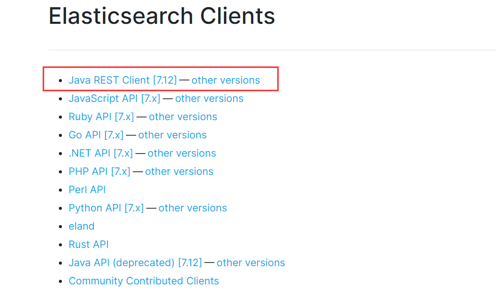

参考链接：[elasticsearch官网](https://www.elastic.co/cn/elasticsearch/)、[elasticsearch官方文档](https://www.elastic.co/guide/cn/elasticsearch/guide/current/index.html)

# 1.ElasticSearch简介

Elasticsearch 是一个分布式、RESTful 风格的搜索和数据分析引擎，能够解决不断涌现出的各种用例。

## ES和Solr有什么区别？

|            | ElasticSearch                        | Solr                                       |
| ---------- | ------------------------------------ | ------------------------------------------ |
| 安装       | 开箱即用，解压就可以                 | 安装稍微复杂一点                           |
| 分布式管理 | 自带分布式协调管理功能               | 利用Zookeeper进行分布式管理                |
| 数据格式   | 仅支持json格式                       | 支持多种数据格式，如：xml、json、csv...    |
| 功能提供   | 注重核心功能，高级功能提供有插件安装 | 功能较多                                   |
| 查询效率   | 实时性查询快，建立索引快             | 查询快，更新索引时慢（增删改慢）           |
| 维护       | 开发维护者较少，更新快，学习成本高   | 有一个更大，更成熟的用户、开发和贡献者社区 |

# 2.安装elasticsearch、elasticsearch head

## 安装elasticsearch

> 安装前需要环境支持：jdk1.8、nodejs

下载地址：[https://www.elastic.co/cn/downloads/elasticsearch](https://www.elastic.co/cn/downloads/elasticsearch)


### 目录说明：

```
-bin	启动文件
-config	配置文件
	-log4j	日志配置文件
	-jvm.options	java虚拟机相关配置
	-elasticsearch.yml	es的配置文件，默认端口：9200
-lib	相关jar包
-logs	日志
-modules	功能模块
-plugins	插件
```

解压成功后，点击elasticsearch.bat就可以启动了，访问localhost:9200，如下：


## 安装elasticsearch head

> 简介：head是可视化工具，主要用于做数据展示，方便查看自己存储的数据，而对数据的查询一般使用Kibana。

下载地址：[https://github.com/mobz/elasticsearch-head](https://github.com/mobz/elasticsearch-head)

可以通过git clone下来，也可以下载压缩包。

下载完成后进行解压，==注意一定要有node环境==，进入到解压目录下：

```
# 安装模块
npm install

# 启动head
npm run start

# 访问地址
localhost:9100
```

### 解决跨域问题：

启动后发现存在跨域问题。

```
# 打开配置文件
config/elasticsearch.yml

# 在末尾配置如下，开启跨域支持，并允许所有可以访问
http.cors.enabled: true
http.cors.allow-origin: "*"
```

访问localhost:9100，成功连接到es如下：


可以把es看成数据库，索引就是库，文档就是表。

# 3.了解ELK

ELK是Elasticsearch 、Logstash、Kibana三大开源框架的简称：

> 数据的冲洗过滤（Logstash） > 数据收集（Elasticsearch ） > 数据分析展示（Kibana）

- Elasticsearch ：基于Lucene、分布式、通过Restful近实时搜索平台框架。
- Logstash：是ELK的中央数据引擎，用于从不同目标（文件/MQ/数据存储）收集不同的格式数据，经过滤后支持输出到不同目的（文件/MQ/redis/es/kafka等）。
- Kibana是将es的数据友好的展示出来，提供实时分析功能。

## 下载安装Kibana

下载链接：[Kibana下载链接](https://www.elastic.co/cn/downloads/kibana)


进入bin目录：bin/Kibana.bat

启动：localhost:5601

访问成功如下：


### 中文汉化配置：

KiBana默认是支持中文汉化的，该文件路径可以看到中文汉化文件：x-pack\plugins\translations\translations\zh_CN.json。

进入Kibana配置文件进行汉化配置：config\Kibana.yml

最后行加上：i18n.locale: "zh-CN"

重启Kibana重新访问：


# 4.了解ES

## 核心介绍

> elasticsearch是面向文档的。核心：索引、字段类型、文档

| Relational DB  | Elasticsearch                    |
| -------------- | -------------------------------- |
| 数据库database | 索引indeces                      |
| 表tables       | 类型types（==8.0版本后被弃用==） |
| 行rows         | 文档documents                    |
| 列columns      | 字段fields                       |

## 架构设计

### 物理设计：

es在后台把每个索引划分成多个分片，每个分片可以在集群中不同服务器进行迁移。

### 逻辑设计：

一个索引类型中，包含多个文档，在查找过程中，按照顺序查找：索引 > 类型 > 文档ID，这样就可以准确的定位到文档，文档ID是由字符串组成。

## 倒排索引：

例如我们有两个文档如下：

1. The quick brown fox jumped over the lazy dog
2. Quick brown foxes leap over lazy dogs in summer

将文档中的内容拆分成词条，不重复的排序如下：

```
Term      文档1   文档2
-------------------------
Quick   |       |  √
The     |   √   |
brown   |   √   |  √
dog     |   √   |
dogs    |       |  √
fox     |   √   |
foxes   |       |  √
in      |       |  √
jumped  |   √   |
lazy    |   √   |  √
leap    |       |  √
over    |   √   |  √
quick   |   √   |
summer  |       |  √
the     |   √   |
------------------------
```

这时候想搜索“lazy dog”，只需要查找包含这个词条的文档：

```
Term      文档1   文档2
-------------------------
lazy    |   √   |  √
dog     |   √   |
------------------------
Total   |   2   |  1
```

第一个文档比第二个文档的匹配度更高，所以只需要根据第一个文档去查找即可。

> 可以这么理解，正排索引就是根据索引直接查找，倒排索引是先将索引文档进行拆分，去查找匹配度较高的文档。

# 5.IK分词器

## 什么是分词?

把一段中文或者是英文分成一个个关键字，在搜索的时候就会把输入的内容进行分词，然后与索引库中进行匹配操作，如elasticsearch可以分成：elastic、search、elasticsearch三种情况。

> IK提供了两种分词算法：
>
> - ik_smart最少划分。
> - ik_max_word最细力度划分。

下载链接：[IK分词器下载](https://github.com/medcl/elasticsearch-analysis-ik/releases)

将下载的包解压放到elasticsearch的插件文件plugins下，然后再重启。

==注意：解压后的文件重命名为ik，否则会导致启动闪退==


## Kibana测试IK分词

打开kibana左侧的“开发工具”：


以JSON的格式进行数据发送，点击按钮发送请求：


发送ik_smart类型的分词请求：

```json
GET _analyze
{
  "analyzer": "ik_smart",
  "text": "大家一起学Java"
}

// 结果如下：
{
  "tokens" : [
    {
      "token" : "大家",
      "start_offset" : 0,
      "end_offset" : 2,
      "type" : "CN_WORD",
      "position" : 0
    },
    {
      "token" : "一起",
      "start_offset" : 2,
      "end_offset" : 4,
      "type" : "CN_WORD",
      "position" : 1
    },
    {
      "token" : "学",
      "start_offset" : 4,
      "end_offset" : 5,
      "type" : "CN_CHAR",
      "position" : 2
    },
    {
      "token" : "java",
      "start_offset" : 5,
      "end_offset" : 9,
      "type" : "ENGLISH",
      "position" : 3
    }
  ]
}
```

发送ik_max_word类型的分词请求：

```json
GET _analyze
{
  "analyzer": "ik_max_word",
  "text": "大家一起学Java"
}

// 结果如下：
{
  "tokens" : [
    {
      "token" : "大家",
      "start_offset" : 0,
      "end_offset" : 2,
      "type" : "CN_WORD",
      "position" : 0
    },
    {
      "token" : "一起",
      "start_offset" : 2,
      "end_offset" : 4,
      "type" : "CN_WORD",
      "position" : 1
    },
    {
      "token" : "一",
      "start_offset" : 2,
      "end_offset" : 3,
      "type" : "TYPE_CNUM",
      "position" : 2
    },
    {
      "token" : "起",
      "start_offset" : 3,
      "end_offset" : 4,
      "type" : "COUNT",
      "position" : 3
    },
    {
      "token" : "学",
      "start_offset" : 4,
      "end_offset" : 5,
      "type" : "CN_CHAR",
      "position" : 4
    },
    {
      "token" : "java",
      "start_offset" : 5,
      "end_offset" : 9,
      "type" : "ENGLISH",
      "position" : 5
    }
  ]
}
```

从上面可以发现：

- ik_smart：最少划分，从头到尾，不重复的划分。
- ik_max_word：最小力度划分，最词穷划分，可能会重复划分某个词。

### 自定义IK分词器

==我们想将“一起学”划分在一块，这可怎么办？==

通过如下步骤进行配置：

- 新建自己的分词文件：plugins\ik\config\my.dic。
- 在文件中添加"一起学"如下：


- 在文件plugins\ik\config\IKAnalyzer.cfg.xml中指定my.dic文件如下：


重新启动elasticsearch，加载了刚刚配置的文件：


发现“一起学”没有被拆分如下：


# 6.Rest命令

主要的操作命令有一下几种：

| method | url                                             | description            |
| ------ | ----------------------------------------------- | ---------------------- |
| PUT    | localhost:9200/索引名称/类型名称/文档id         | 创建文档（指定文档id） |
| POST   | localhost:9200/索引名称/类型名称                | 创建文档（随机文档id） |
| POST   | localhost:9200/索引名称/类型名称/文档id/_update | 修改文档               |
| DELETE | localhost:9200/索引名称/类型名称/文档id         | 删除文档               |
| GET    | localhost:9200/索引名称/类型名称/文档id         | 通过id查询文档         |
| POST   | localhost:9200/索引名称/类型名称/_search        | 查询所有文档           |

## （1）操作索引

在Kibana的开发工具中进行索引操作

### ES字段有哪些类型？

- 字符串类型：text、keyword(不可分割)
- 数值类型：long、integer、shor、byte、double、float、half fload、scaled fload
- 日期类型：date
- 布尔类型：noolean
- 二进制类型：binary
- 等等...

### 1.创建索引

发送创建索引请求，返回结果为created：

```json
PUT /索引名称/类型名称/文档id
{
    请求体JSON
}

// 发送如下请求
PUT /test1/type1/1
{
  "name": "张三",
  "age": "13",
  "sex": "男"
}
```


创建成功后，打开head查看：


### 2.创建索引规则。

```json
PUT /test2
{
  "mappings": {
    "properties": {
      "name": {
        "type": "text"
      },
      "phone": {
        "type": "long"
      },
      "birthday": {
        "type": "date"
      }
    }
  }
}
```


在head可以看到创建成功：


### 3.通过GET请求获取索引信息。

### 4.创建索引不指定类型。

若不指定类型，es会默认的帮我们设置类型：

```json
PUT /test3/_doc/1
{
  "name": "张三",
  "age": 22,
  "birthday": "1999-01-01"
}

GET test3
```


### 5.通过GET _cat命令查看es状况

可以查看的信息有：开启状态、uuid、文档数量、已删除数量、大小等。

```json
GET _cat/indices?v
```


### 6.修改索引信息

方法一：通过插入覆盖方式进行修改

```json
PUT /test3/_doc/1
{
  "name": "张三123",
  "age": 22,
  "birthday": "1999-01-01"
}
```

修改成功，version为2，如下：


查看数据：


方法二：通过POST方式修改

```json
POST /test3/_doc/1/_update
{
    "doc": {
        "name": "张三是菜鸟"
    }
}
```

修改成功，version为3：


查看数据：


### 7.删除索引

```json
DELETE /test1
```

删除成功：


## （2）文档操作

### 1.创建文档

```json
PUT /user/student/1
{
    "name": "张三",
    "age": 13,
    "desc": "广东靓仔一枚",
    "tags": ["学习", "浓发", "美男"]
}
```


多添加几条数据如下：


### 2.查看文档

```json
GET /user/student/1
```


### 3.更新数据

- #### PUT方式更新

```json
PUT /user/student/3
{
    "name": "王五55555",
    "age": 25,
    "desc": "隔壁老王，偷偷学习",
    "tags": ["大猪蹄子", "渣男", "开车"]
}
```


不推荐使用，因为不写的属性会置空。

- #### POST _update方式更新

```json
POST user/student/2/_update
{
    "doc": {
        "name": "李四1234"
    }
}
```


修改成功如下：


### 4.模糊查询

```json
GET user/student/_search?q=name:李四
```


<<<<<<< HEAD
## （3）复杂查询
=======
## 6.3复杂查询

### 6.3.1.match查询

hit：查询到的对象，包含了索引、文档信息、总数和分值等，其中分值越大，越符合查询结果，也排在越靠前的位置。

```json
GET user/student/_search
{
  "query": {
    "match": {
      "name": "张三"
    }
  }
}
```


### 6.3.2._source只查询对应属性的信息

```json
GET user/student/_search
{
  "query": {
    "match": {
      "name": "张三"
    }
  },
  "_source": ["name", "age"]
}
```

如下图只查询了两个属性的信息。


### 6.3.3.sort排序查询

根据age正序排序

```json
GET user/student/_search
{
  "query": {
    "match": {
      "name": "张三"
    }
  },
  "sort": [{
    "age": {
      "order": "asc"
    }
  }]  
}
```


### 6.3.4.from、size分页查询

- from：起始页，从0开始

- size：单页面数据量

```json
GET user/student/_search
{
  "query": {
    "match": {
      "name": "张三"
    }
  },
  "sort": [{
    "age": {
      "order": "asc"
    }
  }],
  "from": "0",
  "size": "1"  
}
```


### 6.3.5.bool多条件查询

#### （1）must（and）

> must（and），所有条件都要符合查询 ... where id = 1 and name = 'zs'。

```json
GET user/student/_search
{
  "query": {
    "bool": {
      "must": [{
        "match": {
          "name": "张三"
        }
      }, {
        "match": {
          "age": "13"
        }
      }]
    }
  }
}
```


#### （2）should（or）

> should（or）：只要有一个条件符合 ... where id = 1 or name = 'zs'

```json
GET user/student/_search
{
  "query": {
    "bool": {
      "should": [{
        "match": {
          "name": "张三"
        }
      }, {
        "match": {
          "age": "13"
        }
      }]
    }
  }
}
```


#### （3）must_not（not）

将年龄不在13岁的全部查出来

```json
GET user/student/_search
{
  "query": {
    "bool": {
      "must_not": [{
        "match": {
          "age": "13"
        }
      }]
    }
  }
}
```

### 6.3.6.范围查询

- gt（greater than）：大于
- gte（greater than equal）：大于等于
- lt（less than）：小于
- lte（less than equal）：小于等于

查询 age > 15 的数据。

```json
GET user/student/_search
{
  "query": {
    "bool": {
      "must": [{
        "match": {
          "name": "张三"
        }
      }],
      "filter": [
        {
          "range": {
            "age": {
              "gt": 15
            }
          }
        }
      ]
    }
  }
}
```


### 6.3.7.query多条件查询

#### 1.模糊查询

```json
GET user/student/_search
{
  "query": {
    "match": {
      "tags": "男 猪"
    }
  }
}
```

通过空格可以进行多条件查询，通过分值可以看到，匹配度越高分值越高。


#### 2.精确查询

> term查询是至二级通过倒排索引指定词条进行精确查询

- term：直接精确查询。
- match：会使用分词器解析，先分析文档然后通过文档查询。

term的查询效率比match要高。

注意：text类型会被分词器解析，而keyword不会被分词器解析。

**创建一个索引：**

name字段类型为text，而desc类型为keyword

```json
PUT test1
{
  "mappings": {
    "properties": {
      "name": {
        "type": "text"
      },
      "desc": {
        "type": "keyword"
      }
    }
  }
}
```

**添加两条数据：**

```json
PUT test1/_doc/1
{
  "name": "张三 name",
  "desc": "张三 desc"
}

PUT test1/_doc/2
{
  "name": "张三 name2",
  "desc": "张三 desc2"
}
```

**term查询text类型：**

```json
GET test1/_search
{
    "query": {
        "term": {
            "name": "张"
        }
    }
}
```

因为text会被分词解析，所以相关的都会被查询到。


**term查询keyword类型：**

```json
GET test1/_search
{
    "query": {
        "term": {
            "desc": "张"
        }
    }
}
```


```json
GET test1/_search
{
    "query": {
        "term": {
            "desc": "张三 desc"
        }
    }
}
```


> 因为keyword类型的不会被分词器解析，需要完全匹配才能查询到

#### 3.精确多条件查询

```json
# 添加两条数据
PUT test1/_doc/3
{
  "t1": "11",
  "t2": "2020"
}

PUT test1/_doc/4
{
  "t1": "22",
  "t2": "2021"
}

# 进行多条件精确查询
GET test1/_search
{
  "query": {
    "bool": {
      "should": [
        {
          "term": {
            "t1": "11"
          }
        },
        {
          "term": {
            "t1": "22"
          }
        }
      ]
    }
  }
}
```

查询效果如下：


### 6.3.8.高亮查询

```json
GET user/student/_search
{
  "query": {
    "match": {
      "name": "张三"
    }
  },
  "highlight": {
    "fields": {
      "name": {}
    }
  }
}
```


**自定义高亮：**

```json
GET user/student/_search
{
  "query": {
    "match": {
      "name": "张三"
    }
  },
  "highlight": {
    "pre_tags": "<p class='name' style='color: red'>",
    "post_tags": "</p>", 
    "fields": {
      "name": {}
    }
  }
}
```


#### 总结：

> 匹配、条件匹配、精确匹配、区间范围匹配、匹配字段过滤、多条件查询、高亮查询

# 7.ES集成SpringBoot

官网查看es的客户端：


这里使用REST风格：



查看es要的maven依赖：


## 7.1创建SpringBoot项目

### 7.1.1勾选需要的依赖：


### 7.1.2将RestHighLevelClientBean注入：

```java
@Configuration
public class ElasticSearchConfig {
    
    @Bean
    public RestHighLevelClient restHighLevelClient() {
        // 将RestHighLevelClient放入到spring中待使用
        return new RestHighLevelClient(
                RestClient.builder(
                        new HttpHost("127.0.0.1", 9200, "http")
                )
        );
    }
}
```

## 7.2索引操作

### 7.2.1创建索引

创建索引：create -> PUT

```java
@Resource
private RestHighLevelClient client;

@Test
void testCreateIndex() throws IOException {
    // 创建索引请求
    CreateIndexRequest request = new CreateIndexRequest("cnwanj_index");
    // 客户端执行请求
    CreateIndexResponse createIndexResponse = client.indices().create(request, RequestOptions.DEFAULT);
    System.out.println(createIndexResponse);
}
```

创建成功如下：


### 7.2.1索引是否存在

```java
@Test
void testExistIndex() throws IOException {
    GetIndexRequest request = new GetIndexRequest("cnwanj_index");
    boolean exists = client.indices().exists(request, RequestOptions.DEFAULT);
    System.out.println(exists);
}
```

若索引存在，输出：true

### 7.2.1删除索引

```java
@Test
void TestDeleteIndex() throws IOException {
    DeleteIndexRequest request = new DeleteIndexRequest("cnwanj_index");
    AcknowledgedResponse delete = client.indices().delete(request, RequestOptions.DEFAULT);
    System.out.println(delete.isAcknowledged());
}
```

删除成功后，输出：true

## 7.3文档操作

### 7.3.1创建文档

> 注意在创建文档之前需要先创建索引，可以查看上面

```java
@Test
void TestAddDocument() throws IOException {
    // 创建对象
    User user = new User("张三", 22);
    // 创建请求
    IndexRequest request = new IndexRequest("cnwanj_index");
    request.id("1")
        .timeout(TimeValue.timeValueSeconds(1))
        .timeout("1s")
        .source(JSON.toJSONString(user), XContentType.JSON);
    // 客户端发起请求
    IndexResponse indexResponse = client.index(request, RequestOptions.DEFAULT);

    System.out.println(indexResponse.toString());
    System.out.println(indexResponse.status());
}
```

创建文档成功如下：


### 7.3.2文档是否存在

```java
@Test
void testExistDocument() throws IOException {
    GetRequest request = new GetRequest("cnwnaj_index", "1");
    // 不返回_source上下文
    request.fetchSourceContext(new FetchSourceContext(false))
        .storedFields("_none_");
    boolean exists = client.exists(request, RequestOptions.DEFAULT);
    System.out.println(exists);
}
```

若文档存在，输出：true

### 7.3.3获取文档信息

```java
@Test
void testGetDocument() throws IOException {
    GetRequest request = new GetRequest("cnwanj_index", "1");
    GetResponse getResponse = client.get(request, RequestOptions.DEFAULT);
    // 输出文档内容
    System.out.println(getResponse.getSource());
    // 输出文档全部内容
    System.out.println(getResponse);
}
```

输出结果如下：


### 7.3.4更新文档信息

```java
@Test
void testUpdateDocument() throws IOException {
    UpdateRequest request = new UpdateRequest("cnwanj_index", "1");
    // 设置超时时间
    request.timeout("1s");
    // 更新对象信息
    User user = new User("张三学Java", 11);
    request.doc(JSON.toJSONString(user), XContentType.JSON);
    UpdateResponse update = client.update(request, RequestOptions.DEFAULT);
    System.out.println(update.status());
}
```

更新成功输出：OK


### 7.3.5删除文档信息

```java
@Test
void testDeleteDocument() throws IOException {
    DeleteRequest request = new DeleteRequest("cnwanj_index", "1");
    request.timeout("1s");
    DeleteResponse delete = client.delete(request, RequestOptions.DEFAULT);
    System.out.println(delete.status());
}
```

删除成功输出：OK

### 7.3.6批量新增文档

```java
@Test
void testBulkDocument() throws IOException {
    BulkRequest request = new BulkRequest();
    request.timeout("10s");
    List<User> userList = new ArrayList<>();
    userList.add(new User("张三1", 1));
    userList.add(new User("张三2", 2));
    userList.add(new User("张三3", 3));
    userList.add(new User("张三4", 4));
    userList.add(new User("张三5", 5));
    // 批量请求处理
    for (int i = 0; i < userList.size(); i++) {
        // 批量更新、删除就在这里修改对应的请求体
        request.add(new IndexRequest("cnwanj_index")
                    // id不添加表示默认为随机字符串
                    .id(i + 1 + "")
                    .source(JSON.toJSONString(userList.get(i)), XContentType.JSON));
    }
    BulkResponse response = client.bulk(request, RequestOptions.DEFAULT);
    // 是否失败，返回false代表成功
    System.out.println(response.hasFailures());
}
```

批量新增成功输出：false


### 7.3.7查询

```java
@Test
void testSearch() throws Exception {
    SearchRequest request = new SearchRequest("cnwanj_index");
    // 构建搜索条件
    SearchSourceBuilder sourceBuilder = new SearchSourceBuilder();
    // 查询所有
    // MatchAllQueryBuilder matchAllQueryBuilder = QueryBuilders.matchAllQuery();
    // 精确查询
    TermQueryBuilder termQueryBuilder = QueryBuilders.termQuery("name", "zs1");
    sourceBuilder.query(termQueryBuilder).timeout(new TimeValue(60, TimeUnit.SECONDS));
    // 将构建的条件设置到请求体中
    request.source(sourceBuilder);
    SearchResponse response = client.search(request, RequestOptions.DEFAULT);
    System.out.println(JSON.toJSONString(response.getHits()));
    for (SearchHit hit : response.getHits().getHits()) {
        System.out.println(hit.getSourceAsMap());
    }
}
```

查询输出如下：


>>>>>>> eb20d4247cd64322b25001a16d94c5e625b3cb55
