# 一、Yarn资源调度器

> 1.Yarn是一个资源调度平台，负责为运行程序提供运算资源，相当于操作系统平台。
>
> 2.MapReduce等程序相当于运行在操作系统上的程序。

## 1.Yarn基本架构

构成：ResourceManager、NodeManager、ApplicationMaster和Container等组件。

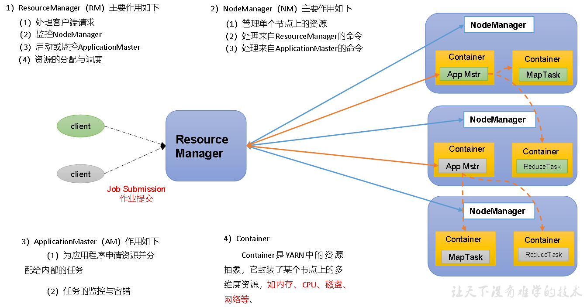

## 2.Yran工作机制

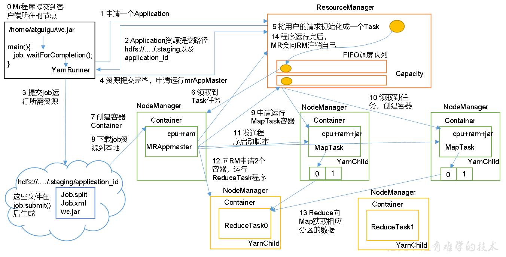

​	（1）MR程序提交到客户端所在的节点。

​	（2）YarnRunner向ResourceManager申请一个Application。

​	（3）RM将该应用程序的资源路径返回给YarnRunner。

​	（4）该程序将运行所需资源提交到HDFS上。

​	（5）程序资源提交完毕后，申请运行mrAppMaster。

​	（6）RM将用户的请求初始化成一个Task。

​	（7）其中一个NodeManager领取到Task任务。

​	（8）该NodeManager创建容器Container，并产生MRAppmaster。

​	（9）Container从HDFS上拷贝资源到本地。

​	（10）MRAppmaster向RM 申请运行MapTask资源。

​	（11）RM将运行MapTask任务分配给另外两个NodeManager，另两个NodeManager分别领取任务并创建容器。

​	（12）MR向两个接收到任务的NodeManager发送程序启动脚本，这两个NodeManager分别启动MapTask，MapTask对数据分区排序。

   （13）MrAppMaster等待所有MapTask运行完毕后，向RM申请容器，运行ReduceTask。

​	（14）ReduceTask向MapTask获取相应分区的数据。

​	（15）程序运行完毕后，MR会向RM申请注销自己。

## 3.作业提交过程

**3.1Hdfs、MapReduce、Yarn之间的关系**

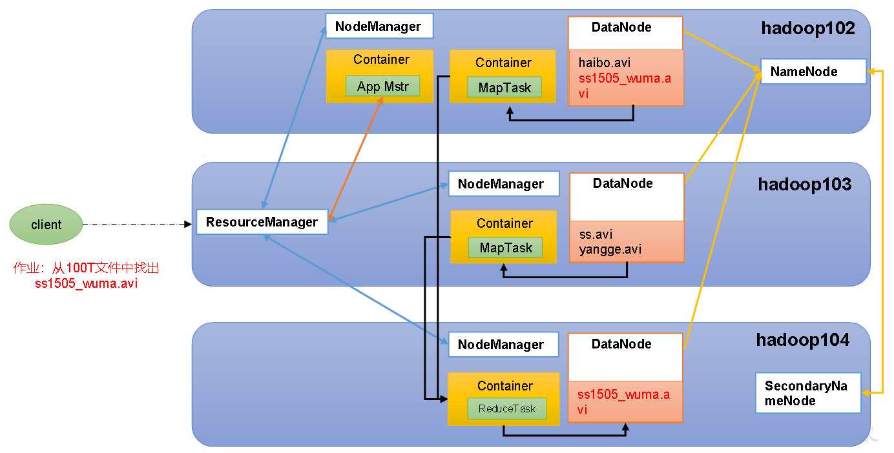

**3.2Hdfs和MapReduce作业提交**

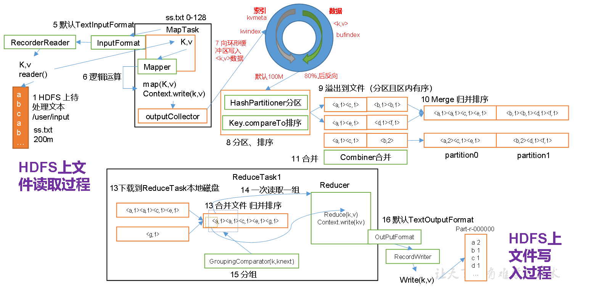

作业提交全过程详解

（1）作业提交

第1步：Client调用job.waitForCompletion方法，向整个集群提交MapReduce作业。

第2步：Client向RM申请一个作业id。

第3步：RM给Client返回该job资源的提交路径和作业id。

第4步：Client提交jar包、切片信息和配置文件到指定的资源提交路径。

第5步：Client提交完资源后，向RM申请运行MrAppMaster。

（2）作业初始化

第6步：当RM收到Client的请求后，将该job添加到容量调度器中。

第7步：某一个空闲的NM领取到该Job。

第8步：该NM创建Container，并产生MRAppmaster。

第9步：下载Client提交的资源到本地。

（3）任务分配

第10步：MrAppMaster向RM申请运行多个MapTask任务资源。

第11步：RM将运行MapTask任务分配给另外两个NodeManager，另两个NodeManager分别领取任务并创建容器。

（4）任务运行

第12步：MR向两个接收到任务的NodeManager发送程序启动脚本，这两个NodeManager分别启动MapTask，MapTask对数据分区排序。

第13步：MrAppMaster等待所有MapTask运行完毕后，向RM申请容器，运行ReduceTask。

第14步：ReduceTask向MapTask获取相应分区的数据。

第15步：程序运行完毕后，MR会向RM申请注销自己。

（5）进度和状态更新

YARN中的任务将其进度和状态(包括counter)返回给应用管理器, 客户端每秒(通过mapreduce.client.progressmonitor.pollinterval设置)向应用管理器请求进度更新, 展示给用户。

（6）作业完成

除了向应用管理器请求作业进度外, 客户端每5秒都会通过调用waitForCompletion()来检查作业是否完成。时间间隔可以通过mapreduce.client.completion.pollinterval来设置。作业完成之后, 应用管理器和Container会清理工作状态。作业的信息会被作业历史服务器存储以备之后用户核查。

## 4.Yarn调度器和算法

> 1.Hadoop调度器主要有3种：FIFO先进先出（First In First Out）、容量（Capacity Scheduler）和公平（Fair Scheduler）。
>
> 2.Apache Hadoop3.1.3默认资源调度器是容器调度器。

### 4.1 FIFO（First In First Out）

单队列，根据提交作业的先后顺序，先来先服务。

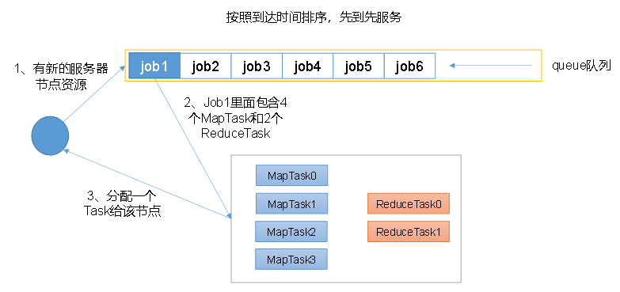

优点：简单易懂。

缺点：不支持多队列，生产环境很少使用。

### 4.2 容量调度器（Capacity Scheduler）

Capacity Scheduler是==Yahoo==开发的多用户调度器。

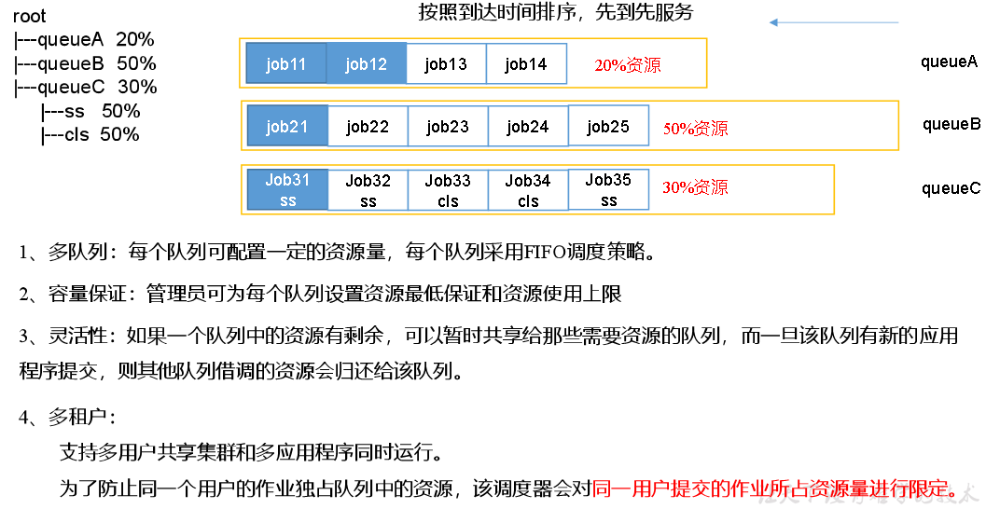

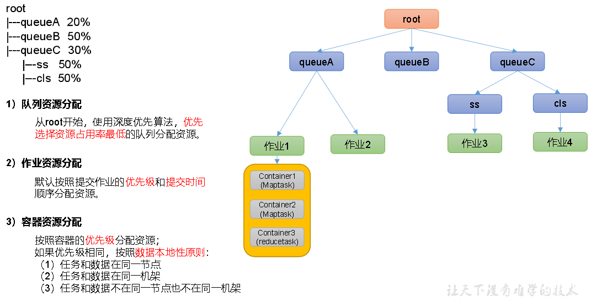

### 4.3 公平调度器（Fair Scheduler）

Fair Schedulere是==Facebook==开发的多用户调度器。

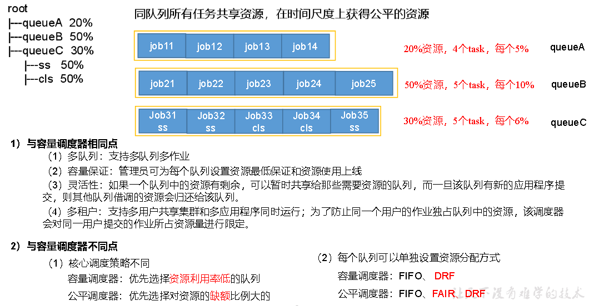

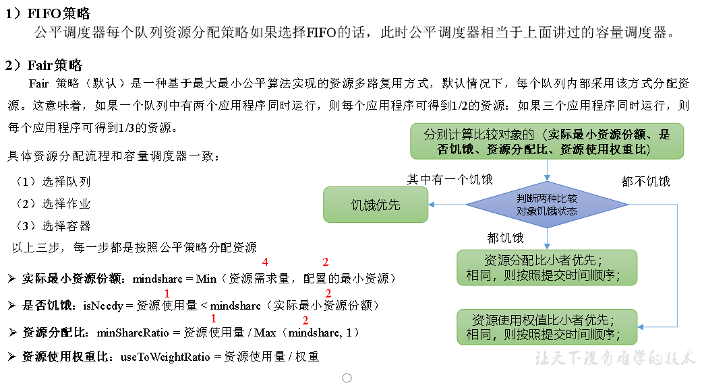

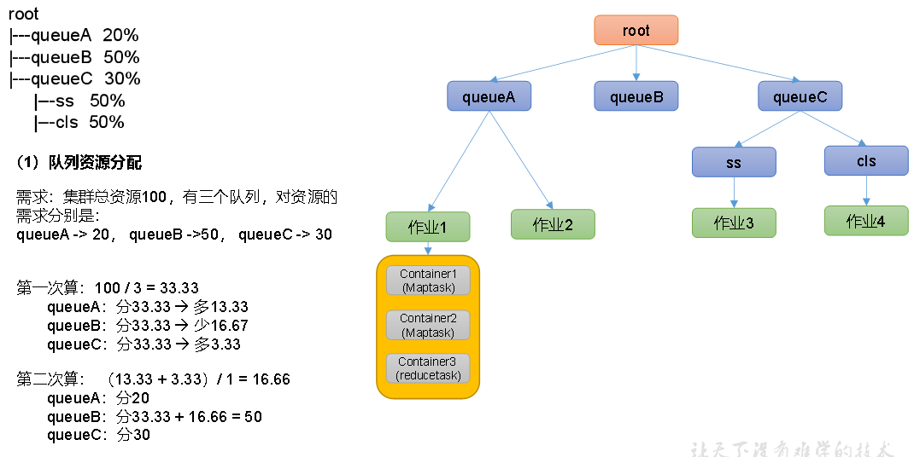

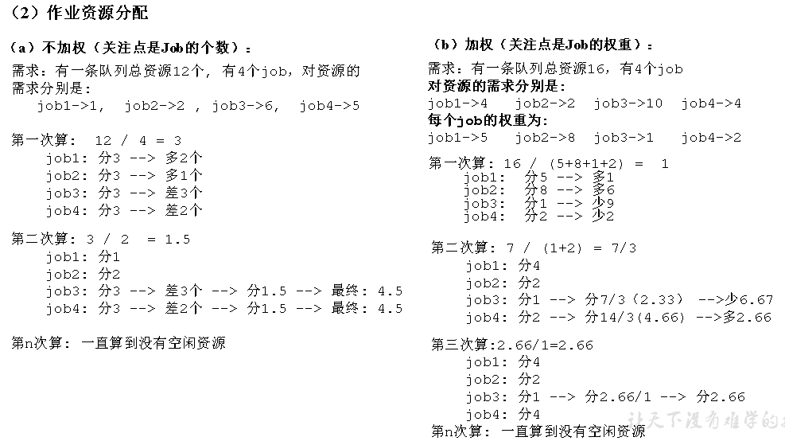

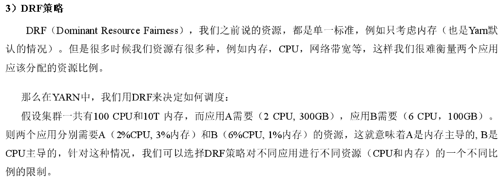

## 5.Yarn常用命令

### 5.1 yarn application查看任务

```shell
# 列出所有Application
yarn application -list

# 根据Application状态过滤（所有状态：ALL、NEW、NEW_SAVING、SUBMITTED、ACCEPTED、RUNNING、FINISHED、FAILED、KILLED）
yarn application -list -appStates FINISHED

# Kill掉Application
yarn application -kill application_1612577921195_0001
```

### 5.2 yarn logs查看日志

```shell
# 查询Application日志
yarn logs -applicationId application_1612577921195_0001

# 查询Container日志
yarn logs -applicationId application_1612577921195_0001 -containerId container_1612577921195_0001_01_000001
```

### 5.3 yarn applicationattempt查看尝试运行的任务

```shell
# 列出所有Application尝试的列表
yarn applicationattempt -list application_1612577921195_0001

# 打印ApplicationAttemp状态
yarn applicationattempt -status appattempt_1612577921195_0001_000001
```

### 5.4 yarn container查看容器

```shell
# 列出所有Container
yarn container -list appattempt_1612577921195_0001_000001

# 打印Container状态
yarn container -status container_1612577921195_0001_01_000001
```

### 5.5 yarn node查看节点状态

```shell
# 列出所有节点
yarn node -list -all
```

### 5.6 yarn rmadmin更新配置

```shell
# 加载队列配置
yarn rmadmin -refreshQueues
```

### 5.7 yarn queue查看队列

```shell
# 打印队列信息
yarn queue -status default
```

# 二、Yarn实例实操

## 1.Yarn生产环境核心参数配置案例

1）需求：从1G数据中，统计每个单词出现次数。服务器3台，每台配置4G内存，4核CPU，4线程。

2）需求分析：

1G / 128m = 8个MapTask；1个ReduceTask；1个mrAppMaster

平均每个节点运行10个 / 3台 ≈ 3个任务（4	3	3）

3）修改yarn-site.xml配置参数如下：

```xml
<configuration>
    <!-- 选择调度器，默认容量 -->
    <property>
        <description>The class to use as the resource scheduler.</description>
        <name>yarn.resourcemanager.scheduler.class</name>
        <value>org.apache.hadoop.yarn.server.resourcemanager.scheduler.capacity.CapacityScheduler</value>
    </property>

    <!-- ResourceManager处理调度器请求的线程数量,默认50；如果提交的任务数大于50，可以增加该值，但是不能超过3台 * 4线程 = 12线程（去除其他应用程序实际不能超过8） -->
    <property>
        <description>Number of threads to handle scheduler interface.</description>
        <name>yarn.resourcemanager.scheduler.client.thread-count</name>
        <value>8</value>
    </property>

    <!-- 是否让yarn自动检测硬件进行配置，默认是false，如果该节点有很多其他应用程序，建议手动配置。如果该节点没有其他应用程序，可以采用自动 -->
    <property>
        <description>Enable auto-detection of node capabilities such as
        memory and CPU.
        </description>
        <name>yarn.nodemanager.resource.detect-hardware-capabilities</name>
        <value>false</value>
    </property>

    <!-- 是否将虚拟核数当作CPU核数，默认是false，采用物理CPU核数 -->
    <property>
        <description>Flag to determine if logical processors(such as
        hyperthreads) should be counted as cores. Only applicable on Linux
        when yarn.nodemanager.resource.cpu-vcores is set to -1 and
        yarn.nodemanager.resource.detect-hardware-capabilities is true.
        </description>
        <name>yarn.nodemanager.resource.count-logical-processors-as-cores</name>
        <value>false</value>
    </property>

    <!-- 虚拟核数和物理核数乘数，默认是1.0 -->
    <property>
        <description>Multiplier to determine how to convert phyiscal cores to
        vcores. This value is used if yarn.nodemanager.resource.cpu-vcores
        is set to -1(which implies auto-calculate vcores) and
        yarn.nodemanager.resource.detect-hardware-capabilities is set to true. The	number of vcores will be calculated as	number of CPUs * multiplier.
        </description>
        <name>yarn.nodemanager.resource.pcores-vcores-multiplier</name>
        <value>1.0</value>
    </property>

    <!-- NodeManager使用内存数，默认8G，修改为4G内存 -->
    <property>
        <description>Amount of physical memory, in MB, that can be allocated 
        for containers. If set to -1 and
        yarn.nodemanager.resource.detect-hardware-capabilities is true, it is
        automatically calculated(in case of Windows and Linux).
        In other cases, the default is 8192MB.
        </description>
        <name>yarn.nodemanager.resource.memory-mb</name>
        <value>4096</value>
    </property>

    <!-- nodemanager的CPU核数，不按照硬件环境自动设定时默认是8个，修改为4个 -->
    <property>
        <description>Number of vcores that can be allocated
        for containers. This is used by the RM scheduler when allocating
        resources for containers. This is not used to limit the number of
        CPUs used by YARN containers. If it is set to -1 and
        yarn.nodemanager.resource.detect-hardware-capabilities is true, it is
        automatically determined from the hardware in case of Windows and Linux.
        In other cases, number of vcores is 8 by default.</description>
        <name>yarn.nodemanager.resource.cpu-vcores</name>
        <value>4</value>
    </property>

    <!-- 容器最小内存，默认1G -->
    <property>
        <description>The minimum allocation for every container request at the RM	in MBs. Memory requests lower than this will be set to the value of this	property. Additionally, a node manager that is configured to have less memory	than this value will be shut down by the resource manager.
        </description>
        <name>yarn.scheduler.minimum-allocation-mb</name>
        <value>1024</value>
    </property>

    <!-- 容器最大内存，默认8G，修改为2G -->
    <property>
        <description>The maximum allocation for every container request at the RM	in MBs. Memory requests higher than this will throw an	InvalidResourceRequestException.
        </description>
        <name>yarn.scheduler.maximum-allocation-mb</name>
        <value>2048</value>
    </property>

    <!-- 容器最小CPU核数，默认1个 -->
    <property>
        <description>The minimum allocation for every container request at the RM	in terms of virtual CPU cores. Requests lower than this will be set to the	value of this property. Additionally, a node manager that is configured to	have fewer virtual cores than this value will be shut down by the resource	manager.
        </description>
        <name>yarn.scheduler.minimum-allocation-vcores</name>
        <value>1</value>
    </property>

    <!-- 容器最大CPU核数，默认4个，修改为2个 -->
    <property>
        <description>The maximum allocation for every container request at the RM	in terms of virtual CPU cores. Requests higher than this will throw an
        InvalidResourceRequestException.</description>
        <name>yarn.scheduler.maximum-allocation-vcores</name>
        <value>2</value>
    </property>

    <!-- 虚拟内存检查，默认打开，修改为关闭 -->
    <property>
        <description>Whether virtual memory limits will be enforced for
        containers.</description>
        <name>yarn.nodemanager.vmem-check-enabled</name>
        <value>false</value>
    </property>

    <!-- 虚拟内存和物理内存设置比例,默认2.1 -->
    <property>
        <description>Ratio between virtual memory to physical memory when	setting memory limits for containers. Container allocations are	expressed in terms of physical memory, and virtual memory usage	is allowed to exceed this allocation by this ratio.
        </description>
        <name>yarn.nodemanager.vmem-pmem-ratio</name>
        <value>2.1</value>
    </property>
</configuration>
```

# 三、总结

- Yarn的工作机制（重点）
- Yarn调度器
  - FIFO、容量、公平
  - 调度器特点：
    - FIFO：支持多队列，可以借资源，支持多用户
    - 优先满足先进来的任务执行
    - 队列中的任务公平享有队列资源
  - apache默认调度器：容量；CDH默认调度器：公平
  - 大数据架构：hive、spark、flink、mr
  - 业务模块：登录、注册、购物车、营销
  - 架构好处：解耦、降低风险、降级使用、支持高并发
  - 生产环境的选择：
    - 中小企业：对并发要求不高，选择容量
    - 中大企业：对并发要求较高，选择公平
- 开发重点掌握：
  - 队列运行原理
  - Yarn常用命令
  - 配置调度器（容器和公平）
  - tool接口使用