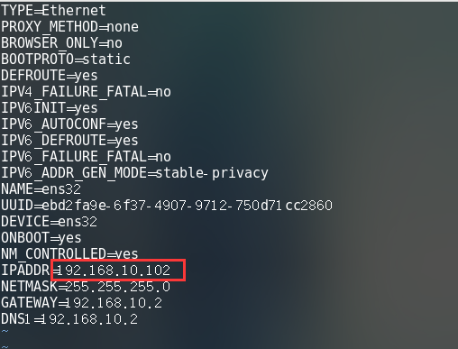

# 一、Hadoop概述

## 1.大数据的特点（4V）

> 按顺序给出数据存储单位: bit、Byte、KB、MB、GB、TB、PB、EB、ZB、YB、BB、NB、DB。
> 1Byte = 8bit、1K = 1024Byte、1MB = 1024K、1G = 1024M、1T = 1024G、1P = 1024T。

### 1.1 Volumn（大量）

目前，人类产生的所有印刷材料的数据是200PB，而历史上全人类总共说过的话的数据大约是5EB。当前，普通的计算机存储容量为TB量级，一些大企业的数据量达到了EB量级。

### 1.2 Velocity（高速）

根据IDC的“数字宇宙”报告，预计到2025年，全球数据的使用量达到163ZB，数据量的增长越来越快。

### 1.3 Variety（多样）

类型的多样性使得数据被分为结构化数据和非结构化数据，相对于以往便于存储的以数据库/文本为主的结构化数据，非结构化数据越来越多，包括网络日志、音频、视频、图片、地理位置等，从而对数据的处理能力提出了更高要求。

### 1.4 Value（低价值密度）

随着数据总量快速上升，价值密度随之变低。如何快速对有价值的数据“提纯”，成为目前大数据背景下要解决的难题。

## 2.大数据发展前景

党的十九大提出“推动互联网、大数据、人工智能和实体经济深度融合”。

## 3.大数据部门间业务流程

- 产品人员提需求（统计双11实时交易额、各个第五销售排行TopN等）。

- 数据部门搭建数据平台、分析数据指标。

- 数据可视化（报表展示、邮件发送、大屏幕展示等）。


## 4.Hadoop是什么？

- Hadoop是由Apache基金会开发的分布式系统基础架构。
- 实现对海量数据存储和海量数据分析计算的解决方案。
- 通常指Hadoop生态圈（HBase、Hive、Zookeeper等）。

## 5.Hadoop组成

### 5.1HDFS概述

#### 5.1.1NameNode(nn)

存储文件元数据，如**文件名、文件目录结构、文件属性**（生成时间、副本数、文件权限），以及每个文件的块列表和块所在DataNode等。

#### 5.1.2DataNode(dn)

本地文件系统**存储文件块数据**，以及**块数据的校验和**。

#### 5.1.3Secondary NameNode(2nn)

每隔一段时间对NameNode元数据**备份**。

> NameNode：目录；DataNode：目录对应的内容


### 5.2Yarn架构

另一种资源协调者（Yet Another Resource Negotiator）简称Yarn，是Hadoop的资源管理器。

- ResourceManager（RM）：整个集群资源（内存、CPU等）的管理者。
- NodeManager（NM）：单个节点服务器资源的管理者。
- Container：容器，提供独立的服务，封装了任务所需的资源（内存、CPU、磁盘、网络等）。
- ApplicationMaster（AM）：单个任务运行的管理者，运行在容器中。


> - 客户端可以有多个。
> - 每个NodeManager有多个Container。
> - 每个Container中可以运行多个ApplicationMaster。

### 5.3MapReduce架构

MapReduce分为Map和Reduce两个阶段

- Map阶段并行处理输入数据。
- Reduce阶段对Map结果进行汇总。


### 5.4HDFS、Yarn、MapReduce之间的关系


### 5.5大数据的生态体系


- 业务模型层：业务模型、数据可视化、业务应用。
- 任务调度层：
  - Oozie任务调度。
  - Azkaban任务调度。
- 数据计算层：
  - MapReduce离线计算（Hive数据查询）。
  - Spark Core内存计算（Spark Mlib数据挖掘、Spark Sql数据查询、Spark Streaming实时计算）。
  - flink。
  - Storm实时计算。
- 资源管理层：Yarn资源调度管理。
- 数据存储层：
  - HDFS文件存储。
  - HBase非关系数据库。
  - Kafka消息队列。
- 数据传输层：
  - Sqoop数据传递。
  - Flume日志收集。
  - Kafka消息队列。
- 数据来源层：
  - 数据库（结构化数据）。
  - 文件日志（半结构化数据）。
  - 视频和ppt等（非结构化数据）。

# 二、Linux CentOS7环境准备

## 1.CentOS7连接外部网络

> 准备：在VMWare中安装上CentOS7

### 1.1VMWare配置

（1）选择“虚拟网络编辑器”


（2）选择“VMnet8”，点击“更改设置”


（3）输入子网IP：192.168.1.2，子网掩码：255.255.255.0


（4）点击“NAT设置”


（5）输入网关IP：192.168.1.2，点击确定，这样就完成了VMWare的配置了。


### 1.2Win10的配置

（1）选择VMnet8，鼠标右键，选择属性


（2）配置如下，配置完成点击确定

IP地址：192.168.1.1

子网掩码：255.2525.255.0

默认网关：192.168.1.2

DNS(P)：192.168.1.2

DNS(A)：8.8.8.8


### 1.3CentOS7配置

（1）进入root模式，输入密码

```shell
su root
```

（2）修改配置文件（注意，一定要进入root模式，否则打开空白）

```shell
vim /etc/sysconfig/network-script/ifcfg-ens32
```

（3）修改配置内容

```shell
# 修改BOOTPROTO为static，IP地址为静态模式
BOOTPROTO=static

# 加入以下地址
IPADDR=192.168.1.5		# IP地址，ifconfig命令查看
NETMASK=255.255.255.0	# 子网掩码
GATEWAY=192.168.1.2		# 网关
DNS1=192.168.1.2		# 域名解析器
```


（4）重启后，验证网络

```shell
# 重启
reboot
# 验证网络
ping www.baidu.com
```


这样网络就配置成功了！

### 1.4XShell连接

> 注意：设置的IP地址（IPADDR）第三位要与网关（GATWAY）一致，如我这里的第三位都是“1”。
>
> IPADDR=192.168.1.5
> GATEWAY=192.168.1.2
>
> 否则xshell不能通过ip地址连接上主机CentOS


连接上输入用户名和密码就可以连接成功了。

## 2.hosts文件映射

- 进入win10路径：C:\Windows\System32\drivers\etc
- 打开hosts文件
- 将下面映射复制到hosts文件中

```
192.168.1.5 hadoop5
192.168.1.6 hadoop6
192.168.1.7 hadoop7
192.168.1.8 hadoop8
192.168.1.9 hadoop9
192.168.1.10 hadoop10
192.168.1.11 hadoop11
192.168.1.12 hadoop12
```

# 三、Hadoop运行模式

## 3.1本地运行模式

### 3.1.1准备本地环境

（1）安装epel-release软件包

相当于一个软件仓库、大多数rpm包在官方的repository是找不到的。

```shell
yum install -y epel-release
```

安装成功如下：


（2）关闭防火墙

```shell
# 关闭防火墙
systemctl stop firewalld

# 关闭开机自启
systemctl disable firewalld.service
```

> 注意切换到root权限。

（3）创建用户，并修改用户密码

```shell
useradd weiyh
passwd 123456
```

（4）给用户加上root权限，方便后期用sudo执行root命令

```shell
# 编辑配置文件
vim /etc/sudoers

# 在文件的%wheel后面加上，NOPASSWD: 表示免密码执行
weiyh ALL=(ALL) NOPASSWD:ALL
```


（5）在opt创建文件，并修改所属用户和组

```shell
# 创建文件夹
mkdir tools
mkdir software

# 修改改所属用户和组
sudo chown weiyh:weiyh tools/ software/

# 查看tools所属用户和组
drwxr-xr-x. 2 root  root  41 4月  18 2020 tomcat
drwxr-xr-x. 2 weiyh weiyh  6 9月  15 22:18 tools
```

（6）卸载自带的jdk

```shell
rpm -qa | grep -i java | xargs -n1 rpm -e --nodeps
# rpm -qa: 查询安装的所有rpm软件包
# grep -i: 忽略大小写
# xargs -n1: 每次只传递一个参数
# rpm -e --nodeps: 强制卸载软件
```

> 注意切换到root权限。

### 3.1.2克隆虚拟机

（1）将已创建的虚拟机克隆出三个hadoop102、hadoop103、hadoop104。


其他的默认选择，下面选择第二个：


最后选择克隆的目录。

（2）重复按照以上操作克隆出3个虚拟机，并修改对应的IP和名称如下：

```shell
vim /etc/sysconfig/network-scripts/ifcfg-ens32
```




```shell
vim /etc/hoatname
```


修改完成后进行重启，IP地址修改成功如下：


### 3.1.3安装jdk

```shell
# 解压jdk到install文件下
tar -zxvf jdk-8u241-linux-x64.tar.gz -C ../install

# 编辑文件，配置jdk
sudo vim /etc/profile.d/my_env.sh

# 添加内容如下
export JAVA_HOME=/opt/install/jdk1.8.0_241
export PATH=$PATH:$JAVA_HOME/bin

# 刷新配置文件
source /etc/profile
```


> 为什么刷新profile文件就可以了？
>
> 因为profile文件会去循环遍历读取profile.d目录下的*.sh文件，如下：


### 3.1.4安装hadoop

> hadoop的安装配置和jdk差不多

```shell
# 解压hadoop到install安装目录下
sudo tar -zxvf hadoop-3.1.3.tar.gz -C ../install/

# 配置/etc/profile.d/my_env.sh文件
export HADOOP_HOME=/opt/install/hadoop-3.1.3
export PATH=$PATH:$HADOOP_HOME/bin
export PATH=$PATH:$HADOOP_HOME/sbin

# 刷新profile文件
source /etc/profile
```

配置成功如下：


