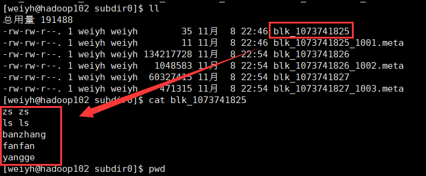
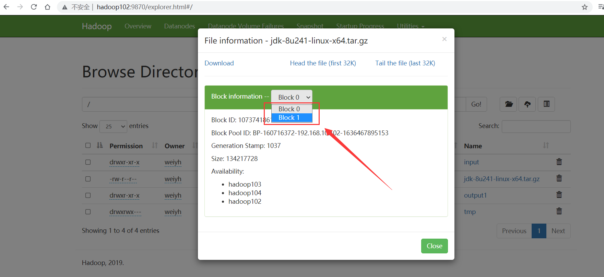

# 一、Hadoop概述

## 1.大数据的特点（4V）

> 按顺序给出数据存储单位: bit、Byte、KB、MB、GB、TB、PB、EB、ZB、YB、BB、NB、DB。
> 1Byte = 8bit、1K = 1024Byte、1MB = 1024K、1G = 1024M、1T = 1024G、1P = 1024T。

### 1.1 Volumn（大量）

目前，人类产生的所有印刷材料的数据是200PB，而历史上全人类总共说过的话的数据大约是5EB。当前，普通的计算机存储容量为TB量级，一些大企业的数据量达到了EB量级。

### 1.2 Velocity（高速）

根据IDC的“数字宇宙”报告，预计到2025年，全球数据的使用量达到163ZB，数据量的增长越来越快。

### 1.3 Variety（多样）

类型的多样性使得数据被分为结构化数据和非结构化数据，相对于以往便于存储的以数据库/文本为主的结构化数据，非结构化数据越来越多，包括网络日志、音频、视频、图片、地理位置等，从而对数据的处理能力提出了更高要求。

### 1.4 Value（低价值密度）

随着数据总量快速上升，价值密度随之变低。如何快速对有价值的数据“提纯”，成为目前大数据背景下要解决的难题。

## 2.大数据发展前景

党的十九大提出“推动互联网、大数据、人工智能和实体经济深度融合”。

## 3.大数据部门间业务流程

- 产品人员提需求（统计双11实时交易额、各个第五销售排行TopN等）。

- 数据部门搭建数据平台、分析数据指标。

- 数据可视化（报表展示、邮件发送、大屏幕展示等）。


## 4.Hadoop是什么？

- Hadoop是由Apache基金会开发的分布式系统基础架构。
- 实现对海量数据存储和海量数据分析计算的解决方案。
- 通常指Hadoop生态圈（HBase、Hive、Zookeeper等）。

## 5.Hadoop组成

### 5.1HDFS概述

**5.1.1NameNode(nn)**

存储文件元数据，如**文件名、文件目录结构、文件属性**（生成时间、副本数、文件权限），以及每个文件的块列表和块所在DataNode等。

**5.1.2DataNode(dn)**

本地文件系统**存储文件块数据**，以及**块数据的校验和**。

**5.1.3Secondary NameNode(2nn)**

每隔一段时间对NameNode元数据**备份**。

> NameNode：目录；DataNode：目录对应的内容


### 5.2Yarn架构

另一种资源协调者（Yet Another Resource Negotiator）简称Yarn，是Hadoop的资源管理器。

- ResourceManager（RM）：整个集群资源（内存、CPU等）的管理者。
- NodeManager（NM）：单个节点服务器资源的管理者。
- Container：容器，提供独立的服务，封装了任务所需的资源（内存、CPU、磁盘、网络等）。
- ApplicationMaster（AM）：单个任务运行的管理者，运行在容器中。


> - 客户端可以有多个。
> - 每个NodeManager有多个Container。
> - 每个Container中可以运行多个ApplicationMaster。

### 5.3MapReduce架构

MapReduce分为Map和Reduce两个阶段

- Map阶段并行处理输入数据。
- Reduce阶段对Map结果进行汇总。


### 5.4HDFS、Yarn、MapReduce之间的关系


### 5.5大数据的生态体系


- 业务模型层：业务模型、数据可视化、业务应用。
- 任务调度层：
  - Oozie任务调度。
  - Azkaban任务调度。
- 数据计算层：
  - MapReduce离线计算（Hive数据查询）。
  - Spark Core内存计算（Spark Mlib数据挖掘、Spark Sql数据查询、Spark Streaming实时计算）。
  - flink。
  - Storm实时计算。
- 资源管理层：Yarn资源调度管理。
- 数据存储层：
  - HDFS文件存储。
  - HBase非关系数据库。
  - Kafka消息队列。
- 数据传输层：
  - Sqoop数据传递。
  - Flume日志收集。
  - Kafka消息队列。
- 数据来源层：
  - 数据库（结构化数据）。
  - 文件日志（半结构化数据）。
  - 视频和ppt等（非结构化数据）。

# 二、Linux CentOS7环境准备

## 1.CentOS7连接外部网络

> 准备：在VMWare中安装上CentOS7

### 1.1VMWare配置

（1）选择“虚拟网络编辑器”


（2）选择“VMnet8”，点击“更改设置”


（3）输入子网IP：192.168.1.2，子网掩码：255.255.255.0


（4）点击“NAT设置”


（5）输入网关IP：192.168.1.2，点击确定，这样就完成了VMWare的配置了。


### 1.2Win10的配置

（1）选择VMnet8，鼠标右键，选择属性


（2）配置如下，配置完成点击确定

IP地址：192.168.1.1

子网掩码：255.2525.255.0

默认网关：192.168.1.2

DNS(P)：192.168.1.2

DNS(A)：8.8.8.8


### 1.3CentOS7配置

（1）进入root模式，输入密码

```shell
su root
```

（2）修改配置文件（注意，一定要进入root模式，否则打开空白）

```shell
vim /etc/sysconfig/network-script/ifcfg-ens32
```

（3）修改配置内容

```shell
# 修改BOOTPROTO为static，IP地址为静态模式
BOOTPROTO=static

# 加入以下地址
IPADDR=192.168.1.5		# IP地址，ifconfig命令查看
NETMASK=255.255.255.0	# 子网掩码
GATEWAY=192.168.1.2		# 网关
DNS1=192.168.1.2		# 域名解析器
```


（4）重启后，验证网络

```shell
# 重启
reboot
# 验证网络
ping www.baidu.com
```


这样网络就配置成功了！

### 1.4XShell连接

> 注意：设置的IP地址（IPADDR）第三位要与网关（GATWAY）一致，如我这里的第三位都是“1”。
>
> IPADDR=192.168.1.5
> GATEWAY=192.168.1.2
>
> 否则xshell不能通过ip地址连接上主机CentOS


连接上输入用户名和密码就可以连接成功了。

## 2.hosts文件映射

- 进入win10路径：C:\Windows\System32\drivers\etc
- 打开hosts文件
- 将下面映射复制到hosts文件中

```
192.168.1.5 hadoop5
192.168.1.6 hadoop6
192.168.1.7 hadoop7
192.168.1.8 hadoop8
192.168.1.9 hadoop9
192.168.1.10 hadoop10
192.168.1.11 hadoop11
192.168.1.12 hadoop12
```

## 3.本地环境

### 3.1准备本地环境

（1）安装epel-release软件包

相当于一个软件仓库、大多数rpm包在官方的repository是找不到的。

```shell
yum install -y epel-release
```

安装成功如下：


（2）关闭防火墙

```shell
# 关闭防火墙
systemctl stop firewalld

# 关闭开机自启
systemctl disable firewalld.service
```

> 注意切换到root权限。

（3）创建用户，并修改用户密码

```shell
useradd weiyh
passwd 123456
```

（4）给用户加上root权限，方便后期用sudo执行root命令

```shell
# 编辑配置文件
vim /etc/sudoers

# 在文件的%wheel后面加上，NOPASSWD: 表示免密码执行
weiyh ALL=(ALL) NOPASSWD:ALL
```


（5）在opt创建文件，并修改所属用户和组

```shell
# 创建文件夹
mkdir tools
mkdir software

# 修改改所属用户和组
sudo chown weiyh:weiyh tools/ install/

# 查看tools所属用户和组
drwxr-xr-x. 2 root  root  41 4月  18 2020 tomcat
drwxr-xr-x. 2 weiyh weiyh  6 9月  15 22:18 tools
```

（6）卸载自带的jdk

```shell
rpm -qa | grep -i java | xargs -n1 rpm -e --nodeps
# rpm -qa: 查询安装的所有rpm软件包
# grep -i: 忽略大小写
# xargs -n1: 每次只传递一个参数
# rpm -e --nodeps: 强制卸载软件
```

> 注意切换到root权限。

### 3.1克隆虚拟机

（1）将已创建的虚拟机克隆出三个hadoop102、hadoop103、hadoop104。


其他的默认选择，下面选择第二个：


最后选择克隆的目录。

（2）重复按照以上操作克隆出3个虚拟机，并修改对应的IP和名称如下：

```shell
vim /etc/sysconfig/network-scripts/ifcfg-ens32
```


```shell
vim /etc/hoatname
```


修改完成后进行重启，IP地址修改成功如下：


### 3.1安装jdk

```shell
# 解压jdk到install文件下
tar -zxvf jdk-8u241-linux-x64.tar.gz -C ../install

# 编辑文件，配置jdk
sudo vim /etc/profile.d/my_env.sh

# 添加内容如下
export JAVA_HOME=/opt/install/jdk1.8.0_241
export PATH=$PATH:$JAVA_HOME/bin

# 刷新配置文件
source /etc/profile
```


> 为什么刷新profile文件就可以了？
>
> 因为profile文件会去循环遍历读取profile.d目录下的*.sh文件，如下：


### 3.1安装hadoop

> hadoop的安装配置和jdk差不多

```shell
# 解压hadoop到install安装目录下
sudo tar -zxvf hadoop-3.1.3.tar.gz -C ../install/

# 配置/etc/profile.d/my_env.sh文件
export HADOOP_HOME=/opt/install/hadoop-3.1.3
export PATH=$PATH:$HADOOP_HOME/bin
export PATH=$PATH:$HADOOP_HOME/sbin

# 刷新profile文件
source /etc/profile
```

配置成功如下：


# 三、Hadoop运行模式

## 1.三种运行模式

- Local（Standalone）Mode：本地模式，单机运行，数据存储在linux本地。
- Pseudo-Distributed Mode：伪分布式，单机运行，具备Hadoop的多有功能，数据存储在HDFS。
- Fully-Distribute Mode：完全分布式，数据存储在HDFS，并且多台服务器工作。

## 2.本地运行模式

### 2.1统计词数

```shell
# 进入hadoop安装目录下新建文件
mkdir wcinput

# 在wcinput文件夹中新建文本
vim word.txt
# 内容如下：
zs zs
ls ls
banzhang
fanfan
yangge

# 回到hadoop目录下，统计词数到wcoutput文件中
bin/hadoop jar share/hadoop/mapreduce/hadoop-mapreduce-examples-3.1.3.jar wordcount wcinput/ ./wcoutput
	-- 通过hadoop命令运行jar包hadoop-mapreduce-examples-3.1.3.jar
	-- 统计wcinput中的词数到wcoutput中
	-- 注意：若输出文件wcoutput存在，会报错
	
# 查看wcoutput中的文件
cat wcoutput/part-r-00000
# 内容如下：
banzhang	1
fanfan	1
ls	2
yangge	1
zs	2
```

运行成功输出到wcoutput文件如下：


查看统计文件如下：


## 3.完全分布式运行模式

### 3.1编写虚拟机分发脚本

**3.1.1scp安全拷贝**

> scp（secure copy）可以实现服务器之间的数据拷贝（from server1 to server2）

基本语法：

（1）从当前服务器推到其他服务（copy to）

```shell
# 在hadoop102中操作，拷贝jdk到hadoop103服务中的目录
scp -r /opt/install/jdk1.8.0_241 weiyh@hadoop103:/opt/install/
	-- -r：递归
	-- hadoop103：服务名称
	-- weiyh：用户名
	
# 拷贝当前目录下的hadoop到hadoop103中
scp -r /opt/install/hadoop-3.1.3 weiyh@hadoop103:/opt/install/
```

（2）从其他服务器拉到当前服务（copy from）

```shell
# 在hadoop103中操作，从hadoop102拉取文件到当前服务
scp -r weiyh@hadoop102:/opt/install/hadoop-3.1.3 /opt/install/
```

（3）在hadoop103中，将102拷贝到104中

```shell
# 在hadoop103中操作，将hadoop102的文件拷贝到hadoop104中
scp -r weiyh@hadoop102:/opt/install/* weiyh@hadoop103:/opt/install/
```

> 若报错如下：
>
> Warning: Permanently added 'hadoop102,192.168.10.102' (ECDSA) to the list of known hosts.
> weiyh@hadoop102's password: 
> .//jdk1.8.0_241: Permission denied
>
> 需要给install文件夹设置权限如下：
>
> sudo chwon weiyh:weiyh install/

**3.1.2rsync远程同步工具**

> - rsync（remote sync）主要用于备份和镜像，具有速度快、避免复制相同内容和支持符号链接的有点
> - rsync和scp区别：scp相对比较慢，rsync只对差异文件做更新同步，scp是把福哦呦都复制过去。

```shell
# 在hadoop102中，将hadoop102中的hadoop-3.1.3文件同步到hadoop103中的hadoop-3.1.3文件
rsync -av hadoop-3.1.3/ weiyh@hadoop103:/opt/install/hadoop-3.1.3
	-- a：复制归档
	-- v：显示过程
```

**3.1.3xsync集群分发脚本**

> 用于循环复制文件到所有节点的相同目录下。

将如下脚本复制到系统的bin目录下

```shell
#!/bin/bash

# 1.判断参数个数
if [ $# -lt 1 ]
then
    echo Not Enough Arguement!
    exit;
fi

# 2.遍历集群所有机器
for host in hadoop102 hadoop103 hadoop104
do
    echo ====================  $host  ====================
    #3.遍历所有目录，挨个发送

    for file in $@
    do
        # 4.判断文件是否存在
        if [ -e $file ]
            then
                # 5.获取父目录
                pdir=$(cd -P $(dirname $file); pwd)

                # 6.获取当前文件的名称
                fname=$(basename $file)
                ssh $host "mkdir -p $pdir"
                rsync -av $pdir/$fname $host:$pdir
            else
                echo $file does not exists!
        fi
    done
done
```

执行如下命令变可执行脚本：

```shell
# 将目录变成可执行脚本
chmod 777 xsync

# 将bin目录及文件复制到其他节点
xsync bin/
```

执行成功后如下：


若需要复制权限文件（profile.d/下的配置文件），可以执行命令：

```shell
# 将my_env.sh文件复制到其他系统
sudo ./bin/xsync /etc/profile.d/my_env.sh

# 刷新配置文件
source /etc/profile
```

**3.1.4SSH免密访问**


- 将A的公钥放到B中，B将允许A免密访问本机。
- 当A访问B时，A携带私钥访问B，B解密A的私钥与其公钥进行匹配，成功后将加密数据返回给A，A再用私钥进行解密。

```shell
# 查看root目录下的隐藏文件
ls -al

# 在.ssh目录下，生成秘钥和公钥（执行后记性3次回车）
ssh-keygen -t rsa
```


id_rsa：秘钥，id_rsa.pub：公钥

```shell
# 将秘钥和公钥拷贝到hadoop103和104
ssh-copy-id hadoop103
ssh-copy-id hadoop104
```

执行后，hadoop103和104的.ssh目录下存在如下文件，可以直接使用"ssh hadoop103"命令免密登录操作。


> 添加秘钥后，可以直接使用xsync命令来复制文件

### 3.2集群配置

**1）集群部署规划**

- NameNode和SecondaryNameNode不要安装在同一台服务器上，因为占内存比较大。
- ResourceManager也消耗很大内存，要独立安装在一台服务器上。

|      | Hadoop102              | Hadoop103                        | Hadoop102                       |
| ---- | ---------------------- | -------------------------------- | ------------------------------- |
| HDFS | ==NameNode==、DataNode | DataNode                         | ==SecondaryNameNode==、DataNode |
| YARN | NodeManager            | ==ResourceManager==、NodeManager | NodeManager                     |

**2）配置文件说明**

> 配置文件分两类：默认配置文件和自定义配置文件，只有修改某一默认配置值时，才用修改对应自定义配置文件，更改相应的值。

默认配置文件：

| 要获取的默认文件     | 文件存放在Hadoop的jar包中的位置                           |
| -------------------- | --------------------------------------------------------- |
| [core-default.xml]   | hadoop-common-3.1.3.jar/core-default.xml                  |
| [hdfs-default.xml]   | hadoop-hdfs-3.1.3.jar/hdfs-default.xml                    |
| [yarn-default.xml]   | hadoop-yarn-common-3.1.3.jar/yarn-default.xml             |
| [mapred-default.xml] | hadoop-mapreduce-client-core-3.1.3.jar/mapred-default.xml |

自定义配置文件：

**core-site.xml**、**hdfs-site.xml**、**yarn-site.xml**、**mapred-site.xml**四个配置文件存放在$HADOOP_HOME/etc/hadoop这个路径上。

**3）配置集群**

（1）核心配置文件：

```shell
# 配置core-site.xml
cd /opt/install/hadoop-3.1.3/etc/hadoop

# 编辑core-site.xml
vim core-site.xml
```

文件配置内容如下：

```xml
<?xml version="1.0" encoding="UTF-8"?>
<?xml-stylesheet type="text/xsl" href="configuration.xsl"?>
<configuration>
    <!-- 指定NameNode的地址 -->
    <property>
        <name>fs.defaultFS</name>
        <value>hdfs://hadoop102:8020</value>
    </property>

    <!-- 指定hadoop数据的存储目录（默认的配置是临时文件） -->
    <property>
        <name>hadoop.tmp.dir</name>
        <value>/opt/install/hadoop-3.1.3/data</value>
    </property>

    <!-- 配置HDFS网页登录使用的静态用户为weiyh -->
    <property>
        <name>hadoop.http.staticuser.user</name>
        <value>weiyh</value>
    </property>
</configuration>
```

（2）HDFS配置文件

```shell
# 配置hdfs-site.xml
vim hdfs-site.xml
```

配置信息如下：

```xml
<?xml version="1.0" encoding="UTF-8"?>
<?xml-stylesheet type="text/xsl" href="configuration.xsl"?>
<configuration>
	<!-- nn web端访问地址-->
	<property>
        <name>dfs.namenode.http-address</name>
        <value>hadoop102:9870</value>
    </property>
	<!-- 2nn web端访问地址-->
    <property>
        <name>dfs.namenode.secondary.http-address</name>
        <value>hadoop104:9868</value>
    </property>
</configuration>
```

（3）YARN配置文件

```shell
# 配置yarn-site.xml
vim yarn-site.xml
```

文件信息如下：

```xml
<?xml version="1.0" encoding="UTF-8"?>
<?xml-stylesheet type="text/xsl" href="configuration.xsl"?>
<configuration>
    <!-- 指定MR走shuffle -->
    <property>
        <name>yarn.nodemanager.aux-services</name>
        <value>mapreduce_shuffle</value>
    </property>

    <!-- 指定ResourceManager的地址-->
    <property>
        <name>yarn.resourcemanager.hostname</name>
        <value>hadoop103</value>
    </property>

    <!-- 环境变量的继承 -->
    <property>
        <name>yarn.nodemanager.env-whitelist</name>
        <value>JAVA_HOME,HADOOP_COMMON_HOME,HADOOP_HDFS_HOME,HADOOP_CONF_DIR,CLASSPATH_PREPEND_DISTCACHE,HADOOP_YARN_HOME,HADOOP_MAPRED_HOME</value>
    </property>
</configuration>
```

（4）MapReduce配置文件

```shell
# 配置mapred-site.xml
vim mapred-site.xml
```

文件信息如下：

```xml
<?xml version="1.0" encoding="UTF-8"?>
<?xml-stylesheet type="text/xsl" href="configuration.xsl"?>

<configuration>
	<!-- 指定MapReduce程序运行在Yarn上 -->
    <property>
        <name>mapreduce.framework.name</name>
        <value>yarn</value>
    </property>
</configuration>
```

将上面的配置文件同步到hadoop103和104

```shell
# 将配置文件同步到hadoop103和104
xsync /opt/install/hadoop-3.1.3/etc/hadoop/
```

### 3.3群起集群

**3.3.1配置workers**

> 该步骤相当于三个节点绑定成集群

```shell
# 编辑workers
vim /opt/install/hadoop-3.1.3/etc/hadoop/workers

# 在workers文件添加如下内容
hadoop102
hadoop103
hadoop104
	-- 注意：内容结尾不允许有空格和换行
	
# 同步到所有节点
xsync /opt/install/hadoop-3.1.3/etc/hadoop/
```

**3.3.2启动集群**

**（1）如果集群是第一次启动，需要在hadoop102节点格式化NameNode**

> 注意：若集群运行过程中报错，需要重新格式化NameNode时，一定要停止namenode和datanode进程，并删除所有机器的data和logs文件，然后再重新格式化。因为格式化NameNode会产生新的集群id，导致NameNode和DataNode的id不一致，集群找不到历史数据。

```shell
# 格式化hadoop102的hdfs namenode
hdfs namenode -format
	-- 格式化后hadoop-3.1.3文件会出现data、logs两个文件
	
# 在hadoop102上启动集群
sbin/start-dfs.sh

# 查看集群进程
jps
```

hadoop102中集群服务如下：


```shell
# hadoop102如下：
[weiyh@hadoop102 hadoop-3.1.3]$ jps
2609 DataNode
2475 NameNode
2892 Jps

# hadoop103如下：
[weiyh@hadoop103 ~]$ jps
2417 Jps
2266 DataNode

# hadoop104如下：
[weiyh@hadoop104 ~]$ jps
2274 DataNode
2519 Jps
2347 SecondaryNameNode
```

**（2）Web端查看**

```shell
# hadoop103启动yarn
sbin/start-yarn.sh

# 启动后hadoop103节点的服务如下：
[weiyh@hadoop103 hadoop-3.1.3]$ jps
2752 NodeManager
2631 ResourceManager
2266 DataNode
3131 Jps
```

HDFS的NameNode：https://hsdoop102:9870

Yarn的ResourceManager：https://hadoop103:8088

在配置了ResourceManager的hadoop103节点中启动yarn服务：

**（3）上传文件到集群**

```shell
# 在hadoop102下创建wcinput文件
hadoop fs -mkdir /wcinput
```


```shell
# 上传本地文件到wcinput
hadoop fs -put wcinput/word.txt /wcinput
```


最终上传的数据存在目录：/opt/install/hadoop-3.1.3/data/dfs/data/current/BP-1705422981-192.168.10.102-1636380209605/current/finalized/subdir0/subdir0



将后面两个文件追加到tmp.tar.gz中

```shell
# 追加到tmp.tar.gz
cat blk_1073741826 >> tmp.tar.gz
cat blk_1073741827 >> tmp.tar.gz

# 再解压tmp.tar.gz
tar -zxvf tmp.tar.gz
```

解压成后发现就是刚刚上传的jdk文件


> 注意：在hadoop103和104节点对应目录上也会备份有相同的数据。

**（4）执行wordcount程序，统计数量**

```shell
# 将wcinput的词数统计到wcoutput中
hadoop jar share/hadoop/mapreduce/hadoop-mapreduce-examples-3.1.3.jar wordcount /wcinput /wcoutput
```

统计成功后如下：


若wcoutput中没有文件，需要在/hadoop-3.1.3/etc/hadoop/mapred-site.xml添加配置如下：

```xml
<configuration>
	<property>
		<name>yarn.app.mapreduce.am.env</name>
		<value>HADOOP_MAPRED_HOME=/opt/install/hadoop-3.1.3</value>
	</property>
	<property>
		<name>mapreduce.map.env</name>
		<value>HADOOP_MAPRED_HOME=/opt/install/hadoop-3.1.3</value>
	</property>
	<property>
		<name>mapreduce.reduce.env</name>
		<value>HADOOP_MAPRED_HOME=/opt/install/hadoop-3.1.3</value>
	</property>
</configuration>
```

添加成后删除wcoutput：

```shell
# 删除wcoutput
hadoop fs -rm -r /wcoutput
```

删除成功后再执行wordcount程序。

**（5）集群崩溃处理方法**

```shell
# 删除所有节点hadoop-3.1.3下的data和logs文件
rm -rf data/ logs

# 在hadoop102上格式化
hdfs namenode -format

# 重新启动
[weiyh@hadoop102 hadoop-3.1.3]$ sbin/start-dfs.sh
[weiyh@hadoop103 hadoop-3.1.3]$ sbin/start-yarn.sh
```


### 3.4配置历史服务器

> 历史服务器主要是用来查看历史服务器运行情况。

```shell
# 编辑mapred-site.xml
vim etc/hadoop/mapred-site.xml
```

加入信息如下：

```xml
    <!-- 历史服务器端地址 -->
    <property>
        <name>mapreduce.jobhistory.address</name>
        <value>hadoop102:10020</value>
    </property>

    <!-- 历史服务器web端地址 -->
    <property>
        <name>mapreduce.jobhistory.webapp.address</name>
        <value>hadoop102:19888</value>
    </property>
```

配置好后需要重新启动yarn

```shell
# 分发到其他节点
xsync etc/hadoop/mapred-site.xml

# 关闭yarn
sbin/stop-yarn.sh

# 开启yarn
sbin/start-yarn.sh

# 启动历史服务器（--daemon表示启动守护进程）
bin/mapred --daemon start historyserver

# 准备数据，创建文件夹
hadoop fs -mkdir /input
# 将本地数据添加到input中
hadoop fs -put wcinput/word.txt /input
# 执行wordcount
hadoop jar share/hadoop/mapreduce/hadoop-mapreduce-examples-3.1.3.jar wordcount /input /output
```

执行完后点击列表的history：


看到配置历史服务器页面如下：


注意：在没有配置之前是打不开该页面的。

### 3.5配置日志聚集

> 日志聚集：应用运行完成以后，将程序运行日志信息上传到HDFS系统上。


```shell
# 配置yarn-site.xml
vim /hadoop-3.1.3/etc/hadoop/yarn-site.xml
```

添加如下配置：

```xml
    <!-- 开启日志聚集功能 -->
    <property>
        <name>yarn.log-aggregation-enable</name>
        <value>true</value>
    </property>
    <!-- 设置日志聚集服务器地址 -->
    <property>  
        <name>yarn.log.server.url</name>  
        <value>http://hadoop102:19888/jobhistory/logs</value>
    </property>
    <!-- 设置日志保留时间为7天 -->
    <property>
        <name>yarn.log-aggregation.retain-seconds</name>
        <value>604800</value>
    </property>
```

```shell
# 分发到其他节点
xsync yarn-site.xml
```

==开启日志聚集功能，需要重新启动NodeManager 、ResourceManager和HistoryServer。==

```shell
# 停止历史服务器
mapred --daemon stop historyserver
# 启动历史服务器
mapred --daemon start historyserver

# 重启yarn
sbin/stop-yarn.sh
sbin/start-yarn.sh

# 执行wordcount
hadoop jar share/hadoop/mapreduce/hadoop-mapreduce-examples-3.1.3.jar wordcount /input /output1
```

选中history的logs就可以看到日志记录如下：


### 3.6集群的启动和停止总结

**1）整体启动（配置ssh前提）**

```shell
# 整体启动/停止hdfs
sbin/start-dfs.sh
sbin/stop-dfs.sh

# 整体启动/停止yarn
sbin/start-yarn.sh
sbin/stop-yarn.sh
```

**2）各个服务组件启动/停止**

```shell
# 启动/停止hdfs组件
hdfs --daemon start namenode/datanode/secondarynamenode
hdfs --daemon stop namenode/datanode/secondarynamenode

# 启动/停止yarn组件
yarn --daemon start resourcemanager/nodemanager
yarn --daemon stop resourcemanager/nodemanager

# 强制杀死进程
kill -9 8888
```

**3）集群启动/关闭脚本**

```shell
#!/bin/bash

if [ $# -lt 1 ]
then
	echo "No Args Input..."
	exit ;
fi

case $1 in
"start")
	echo " ====================== 启动 hadoop 集群 ====================== "
	echo " ------------------- 启动 hdfs ------------------- "
	ssh hadoop102 "/opt/install/hadoop-3.1.3/sbin/start-dfs.sh"
	echo " ------------------- 启动 yarn ------------------- "
	ssh hadoop102 "/opt/install/hadoop-3.1.3/sbin/start-yarn.sh"
	echo " ------------------- 启动 historyserver ------------------- "
	ssh hadoop102 "/opt/install/hadoop-3.1.3/bin/mapred --daemon start historyserver"
;;
"stop")
	echo " ====================== 关闭 hadoop 集群 ====================== "
	echo " ------------------- 关闭 historyserver ------------------- "
	ssh hadoop102 "/opt/install/hadoop-3.1.3/bin/mapred --daemon stop historyserver"
	echo " ------------------- 关闭 yarn ------------------- "
	ssh hadoop102 "/opt/install/hadoop-3.1.3/sbin/stop-yarn.sh"
	echo " ------------------- 关闭 hdfs ------------------- "
	ssh hadoop102 "/opt/install/hadoop-3.1.3/sbin/stop-dfs.sh"
;;
*)
	echo "Input Args Errpr..."
;;
esac
```

配置上面的脚本如下：

```shell
# 将脚本内容加入到该文件
vim bin/myhadoop.sh

# 按i进行复制粘贴，然后按“冒号”，执行wq!保存
wq!

# 变为可执行脚本
chmod 777 myhadoop.sh

# 关闭/启动集群
myhadoop.sh stop
myhadoop.sh start
```

**4）jspall查看所有节点的进程**

```shell
# 编辑jpsall文件
vim jpsall

# 加入查看进程脚本如下
#!/bin/bash

for host in hadoop102 hadoop103 hadoop104
do
	echo ================== $host ==================
	ssh $host jps
done

# 变成可执行脚本
chmod 777 jpsall

# 执行脚本jpsall
jpsall

# 同步到其他节点
xsync bin/
```

查看结果如下：


### 3.7常用端口和配置文件

|                            | hadoop2.x                                                    | hadoop3.x                                                    |
| -------------------------- | ------------------------------------------------------------ | ------------------------------------------------------------ |
| hdfs nameNode 内部通用端口 | 8020、9000                                                   | 8020、9000、9820                                             |
| hdfs nameNode 外部访问端口 | 50070                                                        | 9870                                                         |
| yarn查看任务运行情况       | 8088                                                         | 8088                                                         |
| 历史服务器                 | 19888                                                        | 19888                                                        |
| 常用配置文件               | core-site.xml、hdfs-site.xml、yarn-site.xml、mapred-site.xml、workers | core-site.xml、hdfs-site.xml、yarn-site.xml、mapred-site.xml、salaves |

### 3.8集群同步时间

> ​		如果服务器在公网环境（能连接外网），可以不采用集群时间同步，因为服务器会定期和公网时间进行校准。
>
> ​		如果服务器在内网环境（不能连接网络），必须要配置集群时间同步，否则时间久了，会产生时间偏差，导致集群执行任务时间不同步。

**1）目标**

以hadoop102为时间服务器，周期性的同步时间到其他节点。


**2）配置时间服务器（root用户）**

在hadoop102下操作：

```shell
# 查看ntpd服务状态
sudo systemctl status ntpd
# 开启ntpd服务
sudo systemctl start ntpd
# 设置开机自启
sudo systemctl is-enabled ntpd

# 修改ntp.conf配置文件
sudo vim /etc/ntp.conf

# 修改内容如下：

```

修改内容如下：

```shell
# 将注释打开，授权192.168.10.0到192.168.10.255都可以从该节点查询和同步时间
restrict 192.168.10.0 mask 255.255.255.0 nomodify notrap
# 注释下面内容，集群在局域网中，不使用其他互联网上的时间
#server 0.centos.pool.ntp.org iburst
#server 1.centos.pool.ntp.org iburst
#server 2.centos.pool.ntp.org iburst
#server 3.centos.pool.ntp.org iburst

# 添加内容，当该节点丢失网络，依旧可以使用本地时间
server 127.127.1.0
fudge 127.127.1.0 stratum 10
```

修改hadoop102的/etc/sysconfig/ntpd

```shell
sudo vim /etc/sysconfig/ntpd

# 添加配置，让硬件时间与系统时间一起同步
SYNC_HWCLOCK=yes

# 重启ntpd
sudo systemctl stop ntpd
sudo systemctl start ntpd
# 设置ntpd开机自启
sudo systemctl enable ntpd
```

3）配置其他节点（root用户）

```shell
# 关闭所有节点的ntpd服务
sudo systemctl stop ntpd
sudo systemctl disable ntpd

# 配置一分钟同步一次时间
sudo crontab -e
# 添加内容如下：
*/1 * * * * /usr/sbin/ntpdate hadoop102

# 修改服务器时间
sudo date -s "2021-9-11 11:11:11"
# 过一分钟后查看时间
sudo date
```

## 4.常见错误及解决方案

1）防火墙没关闭、或者没有启动YARN

```
INFO client.RMProxy: Connecting to ResourceManager at hadoop108/192.168.10.108:8032
```

2）主机名称配置错误

3）IP地址配置错误

4）ssh没有配置好

5）root用户和atguigu两个用户启动集群不统一

6）配置文件修改不细心

7）不识别主机名称

```
java.net.UnknownHostException: hadoop102: hadoop102
        at java.net.InetAddress.getLocalHost(InetAddress.java:1475)
        at org.apache.hadoop.mapreduce.JobSubmitter.submitJobInternal(JobSubmitter.java:146)
        at org.apache.hadoop.mapreduce.Job$10.run(Job.java:1290)
        at org.apache.hadoop.mapreduce.Job$10.run(Job.java:1287)
        at java.security.AccessController.doPrivileged(Native Method)
at javax.security.auth.Subject.doAs(Subject.java:415)
```

解决办法：

- 在/etc/hosts文件中添加192.168.10.102 hadoop102。
- 主机名称不要起hadoop  hadoop000等特殊名称。

8）DataNode和NameNode进程同时只能工作一个：


9）执行命令不生效，粘贴Word中命令时，遇到-和长–没区分开。导致命令失效。

- 解决办法：尽量不要直接复制粘贴。

10）jps发现进程已经没有，但是重新启动集群，提示进程已经开启。

- 原因是在Linux的根目录下/tmp目录中存在启动的进程临时文件，将集群相关进程删除掉，再重新启动集群。

11）jps不生效

- 原因：全局变量hadoop java没有生效。解决办法：需要source /etc/profile文件。

12）8088端口连接不上

[atguigu@hadoop102 桌面]$ cat /etc/hosts

注释掉如下代码：

```shell
#127.0.0.1   localhost localhost.localdomain localhost4 localhost4.localdomain4
#::1         hadoop102
```

13）128MB分段存储

- Block Size表示允许存储最大范围，并不是当前不占用内存。
- 如185.53 MB的jdk压缩包会被分成两段存储，即两个Block ID。




# 四、HDFS概述

## 1.HDFS背景和定义

**1）背景**

​		随着数据的增多，单体服务器不能存下所有数据，需要分配到更多系统的磁盘中，导致操作和维护的困难，迫切==需要一种系统来管理多节点上的文件==，就是分布式文件系统，其中HDFS只是其中的一种。

**2）定义**

​		HDFS（Hadoop Distributed File System）分布式文件系统，通过目录树来定位文件，由多个服务器联合实现分布式，每个服务器有各自的角色。

​		使用场景：==一次写入，多次读出，==一个文件经过创建、写入和关闭就不需要改变了。

## 2.HDFS优缺点


## 3.HDFS的架构


1）NameNode（NN），相当于主管、管理者（master）

- 管理HDFS的命名空间。
- 配置资源策略。
- 管理数据块（Block）配置信息。
- 处理客户端的请求。

2）DataNode，相当下属（slave），处理NameNode下达的命令

- 处理NameNode的请求，执行实际的读写操作。
- 存储实际的数据块。

3）Secondary NameNode，并非NN的热备，当NameNode挂了并不能马上替换来提供服务

- 辅助NN分担工作，如定期合并镜像（Fsimage）和编辑（Edits），然后推送给NN。
- 在紧急情况下，可辅助回复NN。

4）Client客户端

- 文件切分，上传到HDFS时，Client将文件切分成多个Block，然后再上传。
- 与NameNode进行交互，获取文件位置及信息。
- Client提供一些命令来管理HDFS，如NameNode格式化，以及zsgc操作

## 4.HDFS块大小（Block）

> HDFS中的文件是物理分块（Block），块的大小可以通过配置参数（dfs.blocksize）来决定的，==Hadoop2.x/3.x版本中默认大小是128M，1.x版本是64M==

- 若寻址时间为10ms（找到目标的时间为10ms）。
- 寻址时间为传输速率的1%为最佳（传输时间：10ms ÷ 0.01 = 1000ms = 1s）。
- 磁盘的传输速率普遍为100MB/s。

**思考：为什么块的大小设置不能太大，也不能太小？**

- 设置小了，会增加寻址时间，会一直从开始位置寻找。
- 设置大了，会降低传输速率，传输时间明显大于寻址时间，导致在处理当前块的数据非常慢。

==总结：HDFS块大小的设置取决于磁盘的传输速率。==

# 五、HDFS的操作

## 1.Shell操作

### 1.1基本语法

```shell
# 查看HDFS命令大全
hadoop fs / hdfs dfs
# 查看命令如下：
Usage: hadoop fs [generic options]
	[-appendToFile <localsrc> ... <dst>]
	[-cat [-ignoreCrc] <src> ...]
	[-checksum <src> ...]
	[-chgrp [-R] GROUP PATH...]
	[-chmod [-R] <MODE[,MODE]... | OCTALMODE> PATH...]
	[-chown [-R] [OWNER][:[GROUP]] PATH...]
	[-copyFromLocal [-f] [-p] [-l] [-d] [-t <thread count>] <localsrc> ... <dst>]
	[-copyToLocal [-f] [-p] [-ignoreCrc] [-crc] <src> ... <localdst>]
	[-count [-q] [-h] [-v] [-t [<storage type>]] [-u] [-x] [-e] <path> ...]
	[-cp [-f] [-p | -p[topax]] [-d] <src> ... <dst>]
	[-createSnapshot <snapshotDir> [<snapshotName>]]
	[-deleteSnapshot <snapshotDir> <snapshotName>]
	[-df [-h] [<path> ...]]
	[-du [-s] [-h] [-v] [-x] <path> ...]
	[-expunge]
	[-find <path> ... <expression> ...]
	[-get [-f] [-p] [-ignoreCrc] [-crc] <src> ... <localdst>]
	[-getfacl [-R] <path>]
	[-getfattr [-R] {-n name | -d} [-e en] <path>]
	[-getmerge [-nl] [-skip-empty-file] <src> <localdst>]
	[-head <file>]
	[-help [cmd ...]]
	[-ls [-C] [-d] [-h] [-q] [-R] [-t] [-S] [-r] [-u] [-e] [<path> ...]]
	[-mkdir [-p] <path> ...]
	[-moveFromLocal <localsrc> ... <dst>]
	[-moveToLocal <src> <localdst>]
	[-mv <src> ... <dst>]
	[-put [-f] [-p] [-l] [-d] <localsrc> ... <dst>]
	[-renameSnapshot <snapshotDir> <oldName> <newName>]
	[-rm [-f] [-r|-R] [-skipTrash] [-safely] <src> ...]
	[-rmdir [--ignore-fail-on-non-empty] <dir> ...]
	[-setfacl [-R] [{-b|-k} {-m|-x <acl_spec>} <path>]|[--set <acl_spec> <path>]]
	[-setfattr {-n name [-v value] | -x name} <path>]
	[-setrep [-R] [-w] <rep> <path> ...]
	[-stat [format] <path> ...]
	[-tail [-f] [-s <sleep interval>] <file>]
	[-test -[defsz] <path>]
	[-text [-ignoreCrc] <src> ...]
	[-touch [-a] [-m] [-t TIMESTAMP ] [-c] <path> ...]
	[-touchz <path> ...]
	[-truncate [-w] <length> <path> ...]
	[-usage [cmd ...]]
	
# 查看对应命令的帮助文档
hadoop fs -help rm
# 帮助文档如下：
-rm [-f] [-r|-R] [-skipTrash] [-safely] <src> ... :
  Delete all files that match the specified file pattern. Equivalent to the Unix
  command "rm <src>"
                                                                                 
  -f          If the file does not exist, do not display a diagnostic message or 
              modify the exit status to reflect an error.                        
  -[rR]       Recursively deletes directories.                                   
  -skipTrash  option bypasses trash, if enabled, and immediately deletes <src>.  
  -safely     option requires safety confirmation, if enabled, requires          
              confirmation before deleting large directory with more than        
              <hadoop.shell.delete.limit.num.files> files. Delay is expected when
              walking over large directory recursively to count the number of    
              files to be deleted before the confirmation.  
```

### 1.2常用命令操作

**1.2.1上传**

1）-moveFromLocal（从本地剪切到HDFS）

```shell
# 创建文件夹
hadoop fs -mkdir /xiyouji

# 创建文件
vim tangseng.txt
# 输入
tangseng
# 从本地剪切到HDFS
hadoop fs -moveFromLocal tangseng.txt  /xiyouji
```

2）-copyFromLocal（从本地拷贝到HDFS）

```shell
# 创建文件
vim sunwukong.txt
# 输入
sunwukong
# 从本地拷贝到HDFS
hadoop fs -copyFromLocal sunwukong.txt /xiyouji
```

3）-put（等同于copyFromLocal）

```shell
# 创建文件
vim zhubajie.txt
# 输入
zhubajie
# 拷贝到HDFS
hadoop fs -put zhubajie.txt /xiyouji
```

4）-appendToFile（追加一个文件内容到已存在的文件末尾）

```shell
# 创建文件
vim shaheshang.txt
# 输入
shaheshang
# 追加本地文件内容到HDFS文件末尾
hadoop fs -appendToFile shaheshang.txt /xiyouji/zhubajie.txt
```

**1.2.2下载**

1）-copyToLocal（从HDFS拷贝到本地）

```shell
# 拷贝到本地
hadoop fs -copyToLocal /xiyouji/tangseng.txt /
```

2）-get（同等于-copyToLocal）

```shell
# 拷贝到本地
hadoop fs -get /xiyouji/tangseng.txt /tangseng1.txt
```

**1.2.3HDFS直接操作**

```shell
# 1.-ls（显示目录）
hadoop fs -ls /

# 2.-cat（查看文件内容）
hadoop fs -cat /xiyouji/tangseng.txt

# 3.-chgrp、-cnmod、-chown（修改文件所属属性，与linux一样）
hadoop fs -chmod 666 /xiyouji/tangseng.txt
# 修改文件分组
hadoop fs -chown weiyh:weiyh /xiyouji/tangseng.txt

# 4.-mkdir（创建文件路径）
hadoop fs -mkdir /xitian

# 5.-cp（从HDFS的一个拷贝到另一个路径）
hadoop fs -cp /xiyouji/tangseng.txt /xitian

# 6.-mv（在HDFS中移动文件）
hadoop fs -mv /xiyouji/sunwukong.txt /xitian
hadoop fs -mv /xiyouji/zhubajie.txt /xitian

# 7.-tail（显示文件末尾1KB内容）
hadoop fs -tail /xiyouji/shaheshang.txt

# 8.-rm（删除文件或文件夹）
hadoop fs -rm /xiyouji/tangseng.txt

# 9.-rm -r（递归删除目录及目录下的文件）
hadoop fs -rm -r /xiyouji

# 10.-du（统计文件夹大小）
hadoop fs -du -s -h /xitian
39  117  /xitian

# 列出文件大小详情
hadoop fs -du -h /xitian
    10  30  /xitian/sunwukong.txt
    9   27  /xitian/tangseng.txt
    20  60  /xitian/zhubajie.txt
	# 27表示文件大小，81表示27*3个副本
	
# 11.-setrep（设置文件副本数量）
hadoop fs -setrep 10 /xitian/tangseng.txt
```


> 这里设置的副本只是记录在NameNode元数据中，真正副本的数量得看DataNode的数量。因为目前只有3个节点，最多也就3个副本，节点增加到10，副本的数量才能达到10。

## 2.HDFS的API操作

### 2.1客户端环境准备

1）下载winutils

下载winutils：https://github.com/cdarlint/winutils.git

配置环境变量：

HADOOP_HOME：E:\dev-tools\linux\system\CentOS-7.0\hadoop\hadoop-3.1.0

Path：%HADOOP_HOME%\bin


2）idea创建一个maven工程项目hdfs-client，并导入依赖如下：

```xml
<dependencies>
    <dependency>
        <groupId>org.apache.hadoop</groupId>
        <artifactId>hadoop-client</artifactId>
        <version>3.1.3</version>
    </dependency>
    <dependency>
        <groupId>junit</groupId>
        <artifactId>junit</artifactId>
        <version>4.12</version>
    </dependency>
    <dependency>
        <groupId>org.slf4j</groupId>
        <artifactId>slf4j-log4j12</artifactId>
        <version>1.7.30</version>
    </dependency>
</dependencies>
```

在项目的src/main/resources目录下，新建log4j.properties文件，并配置日志如下：

```properties
log4j.rootLogger=INFO, stdout  
log4j.appender.stdout=org.apache.log4j.ConsoleAppender  
log4j.appender.stdout.layout=org.apache.log4j.PatternLayout  
log4j.appender.stdout.layout.ConversionPattern=%d %p [%c] - %m%n  
log4j.appender.logfile=org.apache.log4j.FileAppender  
log4j.appender.logfile.File=target/spring.log  
log4j.appender.logfile.layout=org.apache.log4j.PatternLayout  
log4j.appender.logfile.layout.ConversionPattern=%d %p [%c] - %m%n
```

创建包名：com.weiyh.hdfs，并创建类HdfsClient如下：

```java
public class HdfsClient {

	private FileSystem fs;

	@Before
	public void init() throws Exception {
		// 连接集群的NameNode地址，8020为内网端口
		URI uri = new URI("hdfs://hadoop102:8020");
		// 配置文件
		Configuration configuration = new Configuration();
		// 设置副本数量（优先级最大）
		configuration.set("dfs.replication", "2");
		// 操作用户
		String user = "weiyh";
		// 客户端对象
		fs = FileSystem.get(uri, configuration, user);
	}

	@After
	public void close() throws Exception {
		// 关闭客户端
		fs.close();
	}

	// 1.创建文件夹
	@Test
	public void testMkdir() throws Exception {
		fs.mkdirs(new Path("/xiyouji/qujing"));
	}

	// 2.上传文件
	@Test
	public void testPut() throws Exception {
		// 是否删除本地、是否覆盖已存在文件、本地路径、目标路径
		fs.copyFromLocalFile(false, true,
			new Path("D:\\sunwukong.txt"), new Path("/xiyouji/qujing"));
	}

	// 3.下载文件
	@Test
	public void testGet() throws Exception {
		// 是否删除源文件、hdfs路径、本地路径、是否不开启本地校验（增多crc校验文件）
		fs.copyToLocalFile(false, new Path("/xiyouji/qujing/sunwukong.txt"),
			new Path("D:\\sunwukong1.txt"), true);
	}

	// 4.删除文件
	@Test
	public void testDelete() throws Exception {
		// 删除文件，文件路径、是否递归删除
		fs.delete(new Path("/input/word.txt"), false);

		// 删除空文件夹
		fs.delete(new Path("/input"), false);

		// 删除非空文件夹
		fs.delete(new Path("/xitian"), true);
	}

	// 5.移动文件
	@Test
	public void testMove() throws Exception {
		// 修改文件名
		fs.rename(new Path("/output/word.txt"), new Path("/output/word1.txt"));

		// 移动文件并更改名称
		fs.rename(new Path("/output/word1.txt"), new Path("/word2.txt"));

		// 更改文件夹
		fs.rename(new Path("/output"), new Path("/output2"));
	}

	// 6.获取文件详情
	@Test
	public void testFileDetail() throws Exception {
		// 获取文件信息（文件路径、是否递归子目录）
		RemoteIterator<LocatedFileStatus> fileList = fs.listFiles(new Path("/"), true);
		while (fileList.hasNext()) {
			LocatedFileStatus file = fileList.next();
			System.out.println("=============" + file.getPath() + "=============");
			System.out.println("权限：" + file.getPermission());
			System.out.println("用户：" + file.getOwner());
			System.out.println("分组：" + file.getGroup());
			System.out.println("大小：" + file.getLen());
			System.out.println("时间：" + file.getModificationTime());
			System.out.println("副本：" + file.getReplication());
			System.out.println("块大小：" + file.getBlockSize());
			System.out.println("名称：" + file.getPath().getName());
			System.out.println("块信息：" + Arrays.toString(file.getBlockLocations()));
		}
	}

	// 7.判断文件和目录
	@Test
	public void testCheckFile() throws Exception {
		FileStatus[] fileArr = fs.listStatus(new Path("/"));
		for (FileStatus status : fileArr) {
			if (status.isFile()) {
				System.out.println("文件：" + status.getPath().getName());
			} else {
				System.out.println("目录：" + status.getPath().getName());
			}
		}
	}
}
```

> 参数配置优先级（低 > 高）：
>
> hdfs-default.xml > hdfs-site.xml > 客户端资源目录文件hdfs-site.xml > 配置类


