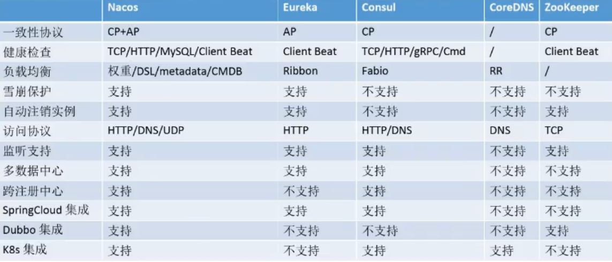

# 一、Java基础知识

## 1.线程的3种创建方式

(1)重写Thread的run()方法

```java
// 方法1：重写run方法，旧写法
new Thread() {
    @Override
    public void run() {
        System.out.println("线程1");
    }
}.start();

// 重写run方法，lambda表达式写法，() -> {}：表示无参无返回值，(res) -> {return r}：表示有参有返回值
new Thread(() -> {
    System.out.println("线程1");
}).start();
```

(2)Runnable()方法实现

```java
// 方法2：Runnable方法实现
new Thread(new Runnable() {
    @Override
    public void run() {
        System.out.println("线程2");
    }
}).start();
```

(3)Callable()方法实现

> 与Runnble的区别就是Callble该方法具有返回值。

```java
// 方法3：Callable方法实现，有返回值
Callable<Integer> callable = () -> {
    return 3;
};
FutureTask<Integer> task = new FutureTask<>(callable);
new Thread(task).start();
System.out.println(task.get());
```

## 2.MySQL和SQLServer的区别

(1)公司

MySQL是由瑞典 MySQL AB 公司开发的关系型数据库管理系统，目前属于 Oracle 旗下公司，源码开源。SQL Server 是Microsoft 公司推出的关系型数据库管理系统，源码不对外开放 。  

(2)性能

mysql简单查询 速度快， 最好不要使用函数/join/group等方式查询。  sqlserver的简单查询速度不如mysql，但复杂查询时，性能下降的不明显。

(3)机器配置要求

相对于sqlserver来说，mysql对机器配置要求不高。 一台pd925/2Gram/sataII硬盘//linux2.6内核 的机器可以轻松处理几千万条记录的数据表。 对于sqlserver，我们使用了 双xeon5110/4Gram/raid10(6块sataII硬盘）/win2000ADserver的机器，数据表也有几千万条记录，结果负荷一高就崩溃了，很不稳定。 

(4)主键自增

mysql有自动增长的数据类型。而sqlserver没有自增类型，需要单独一张表来自定义自增序列号。

## 3.spring事务的失效场景

参考链接：https://blog.csdn.net/Jiangbohao_/article/details/107182301

(1)数据库存储引擎不支持事务

如mysql中的MyISAM引擎不支持事务，而InnoDB引擎才支持事务。

(2)非public修饰方法使用

@Transactional用在public方法上才会生效，否则会导致事务失效。

(3)未被Spring管理

若方法所在的类没有注入spring容器中，这个类就不会被spring管理，这样事务就会失效了。

如下情况就会失效：

```java
// @Service
public class UserServiceImpl implements UserService {
    @Transactional
    public void insertUser(User user) {
    }
}  
```

(4)方法间调用

A方法调用B方法，A没有事务，B设置了事务，会导致B方法事务失效。

(5)异常被处理掉了

在整个事务中使用了try catch，没有将异常抛出，会直接导致事务失效。如下情况就会导致事务失效。

```java 
@Transactional
public void method() {
    try {
        // 更新数据
    } catch (Exception e) {
        return;
    }
}
```

(6)异常类型错误

```java
@Service
public class UserServiceImpl implements UserService {
    @Transactional
    public void updateOrder(User user) {
        try {
            // 更新数据
        } catch (Exception e) {
            throw new Exception("更新错误");
        }
    }
}
```

这样事务也是不生效的，因为默认回滚的是：RuntimeException，如果你想触发其他异常的回滚，需要在注解上配置一下，如：@Transactional(rollbackFor = Exception.class)这个配置仅限于 Throwable 异常类及其子类。 

> 为什么会失效呢？因为Spring在扫描Bean的时候会自动为标注了@Transactional注解的类生成一个代理类（proxy）,当有注解的方法被调用的时候，实际上是代理类调用的，代理类在调用之前会开启事务，执行事务的操作，但是同类中的方法互相调用，相当于this.B()，此时的B方法并非是代理类调用，而是直接通过原有的Bean直接调用，所以注解会失效。

## 3.取余和取模的区别

> 取余和取模是极其相似，常常会让人以为两者是同一样性质，其实不然。在符号相同时，两者不会冲突，符号不同时就会有以下区别：

- 取余：向0舍入。
- 取模：向负无穷舍入。

### 符号相同：

比如：9 / 5会有两个商1和2。

9 = 5 * 1 + 4或9 = 5 * 2 + (-1)，因为是向0舍入，取前者计算结果，9 余 5 = 4，9 模 5 = 4。

### 符号不同：

比如：9 / (-5)会有两个商-1和-2。

9 = (-5) * (-1) + 4或9 = (-5) * (-2) + (-1)，9 余 -5 = 4，9 模 -5 = -1。

### 原则定义：

- 取余：rem(x, y) = x - y * fix(x / y)。
- 取模：mod(x, y) = x - y * floor(x / y)。

fix()向0取整，floor()向负无穷取整。

以x = 9，y = -5为例：

- fix(9, -5) = -1, floor(9, -5) = -2。

- rem(9, -5) = 4，mod(9, -5) = -1。

## 4.Java8新特性

java8新特性主要有：速度提升（红黑树）、Lambda表达式（箭头函数）、方法引用（Integer::compare）、stream工具API、日期工具类优化。

## 5.常用Lamda表达式

```java
// List转Map，并去重key
Map<Integer, User> map = list.stream().collect(Collectors.toMap(User::getId, Function.identity(), (key, value) -> key));

// 添加逗号分隔符
String ids = list.stream().map(User::getId).distinct().collect(Collectors.joining(","));

// 求和
long sum = list.stream().mapToLong(User::getAge).sum();
BigDecimal bigSum = list.stream().map(User::getMoney).reduce(BigDecimal.ZERO, BigDecimal::add);

// 求和存在map中
Map<Integer, Integer> mapSum = list.stream().collect(Collectors.toMap(User::getId, User::getAge, Integer::sum));

// 分组
Map<Integer, List<User>> map = list.stream().collect(Collectors.groupingBy(User::getId, Collectors.toList()));

// 倒序排序
list.sort(Comparator.comparing(User::getId).thenComparing(User::getAge).reversed());
```

## 6.Java线程生命周期

### 6.1线程生命周期4种状态

参考：https://zhuanlan.zhihu.com/p/88920254

> 四种状态：初始化、运行、休眠、终止。

- **初始化状态（NEW）**

  - 线程对象在编程语言级别创建成功，但在操作系统中还并没有创建对应的线程，这个时候的线程还不能获得CPU资源。

- **运行状态（RUNNABLE）**

  - 可运行状态：可以获取CPU资源。
  - 运行中状态：已获取CPU资源。

- **休眠状态（WAITING、TIME_WAITING 、BLOCKED）**

  - 线程调用了堵塞接口进入休眠状态，此时无法获取CPU资源，直到某个条件点（时间）到达会唤醒该线程。

  - BLOCKED：当一个线程在等待synchronizd同步块的锁时，线程会处于BLOCKED状态。

    WAITING：当一个处于RUNNABLE的线程调用该线程的阻塞API时线程进入WAITING状态，直到其他线程将其唤醒。

    TIME_WAITING：在WAITING状态的方法上加了超时时间。

- **终止状态（TERMINATED）**

  - 线程执行结束或遇到异常会终止。

## 7.HashMap

**1）HashMap**


**为什么扩容为2次幂？**

- 不需要重新计算hash值，以及元素的位置。
- 使用位运算符<<进行扩容，效率高。

每次扩容数量：容量 * 2 = 扩容后容量

每次扩容数量：容量 * 2 = 扩容后容量

**2）ConcurrentHashMap实现原理**

- 数组+链表+红黑树、锁头节点。
- 插入和扩容的时候锁定头结点，查询不会加锁。

## 8.Java的IO流

统一的方式来访问不同的输入源和输出源。

- 数据的流向：分为输入流和输出流。
- 数据的类型：分为字节流和字符流。字节为byte（8位），字符为char（16位）。

> Java中的IO流主要有4个基类，分别为处理字节的InputStream和OutputStream，处以及理字符的Reader和Writer。

# 二、Spring基础知识

## 1.Bean的生命周期

主要步骤：实例化、初始化、创建和使用、销毁

- 解析xml或注解配置的类，创建Bean定义BeanDefinition（如Bean的作用域是单例或原型，加载模式是不是懒加载）。
- 通过BeanDefinition反射实例化对象。
- 将实例化的Bean填充对象属性。
- 实现Aware相关接口，如BeanNameAware、BeanClassLoaderAware、BeanFactoryAware等接口。
- 初始化前调用BeanPostProcessor实现类，执行方法postProcessorBeforeInitialization方法。
- Bean初始化（配置init-method、实现InitializingBean接口）。
- 初始化后调用BeanPostProcessor实现类，执行方法postProcessorAfterInitialization方法。
- 将Bean放入Map中，供业务使用。
- 销毁Bean（PreDestroy注解、配置destroy-method、调用DisposableBean接口的destroy()方法）。

## 2.动态代理模式实现AOP

### 2.1静态代理

静态代理，只能代理固定的对象。

```java
interface ClothFactory {

	void produceCloth();
}

class ProxyClothFactory implements ClothFactory {

	private ClothFactory clothFactory;

	public ProxyClothFactory(ClothFactory clothFactory) {
		this.clothFactory = clothFactory;
	}

	@Override
	public void produceCloth() {
		System.out.println("生产前...");
		clothFactory.produceCloth();
		System.out.println("生产后...");
	}
}

class AntaClothFactory implements ClothFactory {

	@Override
	public void produceCloth() {
		System.out.println("生产安踏...");
	}
}

public class StaticProxyTest {
	public static void main(String[] args) {
		// 通过代理工厂去生产安踏
		ClothFactory clothFactory = new ProxyClothFactory(new AntaClothFactory());
		clothFactory.produceCloth();
	}
}
```

### 2.2动态代理，实现AOP

通过Proxy.newProxyInstance实现动态代理。

```java
interface Human {

	String study();

	void eat(String food);

}

class SuperMan implements Human {

	@Override
	public String study() {
		return "我要学习变强";
	}

	@Override
	public void eat(String food) {
		System.out.println("我今天吃" + food);
	}
}

class ProxyFactory {

	// 获取动态代理实例对象
	public static Object getProxyInstance(Object object) {
		// 类加载器、类接口、代理放大类对象
		return Proxy.newProxyInstance(
			object.getClass().getClassLoader(),
			object.getClass().getInterfaces(),
			new MyInvocation(object));
	}
}

// 自定义代理调度器，用于获取被代理对象的方法
class MyInvocation implements InvocationHandler {

	private Object object;

	public MyInvocation(Object object) {
		this.object = object;
	}

	// 通过代理对象掉用方法时，就会自动调用invoke()方法
	@Override
	public Object invoke(Object proxy, Method method, Object[] args) throws Throwable {
		System.out.println("执行方法前调用...");
		Object invoke = method.invoke(object, args);
		System.out.println("执行方法后调用...");
		return invoke;
	}
}

public class ProxyTest {

	public static void main(String[] args) {
		// 获取superman的代理对象
		Human proxyInstance = (Human) ProxyFactory.getProxyInstance(new SuperMan());
		System.out.println(proxyInstance.study());
		proxyInstance.eat("饺子");
		System.out.println("----------------------------");
		// 代理衣服工厂
		ClothFactory clothFactory = (ClothFactory) ProxyFactory.getProxyInstance(new AntaClothFactory());
		clothFactory.produceCloth();
	}
}
```


# 三、MQ基础问题

> 参考：
>
> 博客链接：https://doocs.github.io/advanced-java
>
> CSDN链接：https://blog.csdn.net/lettyisme/article/details/85233008

## 1.为什么用MQ？

> 目的：解耦、异步、削峰

- 解耦：A系统调接口发送数据到BCD系统，若C系统不需要这个数据，或者是E系统需要这个数据，那A系统负责人将忙不过来，导致A系统与其他系统耦合严重。若使用MQ，A系统只需将数据通过MQ发送出去，其他系统需要直接从MQ这里消费，不需要则取消MQ消费即可。A系统压根不用管后面的路程，也不用考虑其他系统是否调用成功、失败超时等情况。
- 异步：A系统需要在本地存库，需要3ms，还要同步数据到BCD系统，需要800ms，总延时过长。使用MQ，发送到本地后发送3条MQ消息的时间的9ms，A系统从接收请求到发送MQ只需要总时长10ms，至于同步数据就让系统去处理了。
- 削峰：A系统平常风平浪静，并发数也就30，一到晚上8点，并发量就达到100k，假如MySQL承受的并发量为20k，一旦这些请求打到MySQL会直接崩溃。这时候可以将请求发送到MQ中，A系统每次拉取20k请求，从而保证了系统的稳定性。

## 2.MQ有什么缺点？

- 系统可用性低：唯一MQ突然G了，整个系统会导致崩溃。
- 系统复杂度高：会引发一系列问题，需要保证消息重复消费、保证消息顺序性、保证消息不丢失等。
- 数据不一致问题：写入多个系统的时候，需要保证所有系统都写入成功。

## 3.消息丢失怎么解决？

> 消息丢失可能会发生在：生产者、MQ、消费者

这里通过RabbitMQ来描述：

- 生产者丢失：
  - 生产者在发送数据到MQ时，因为网络故障导致消息丢失。
  - 此时可以选择MQ提供的事务功能，当MQ没有收到消息时，就会发送异常提示给生产者，这时候就可以通过事务进行回滚。
  - 还可以在生产者这开启confirm模式，每次写消息都会分配一个全局唯一的ID，若成功写入消息到MQ中，则MQ会回传一个成功的Ack消息。若写入失败，则回调一个nack接口，告诉生产者可以重试。
  - 一般选择confirm作为解决消息丢失的处理方案，因为事务会导致消息堵塞，而confirm是通过异步来处理，速度较快。
- MQ丢失：
  - 开启MQ持久化。
  - 创建队列的时候开启持久化。
  - 将发送消息的deliveryMode设置为2，表示持久化。
- 消费者丢失：
  - 关闭自动ack回应。
  - 在代码中进行自定义ack。
  - 若一直没有ack，MQ会把这个消息分配给其他消费者消费。

## 4.MQ之间的区别

> 主要MQ有：ActiveMQ、RabbitMQ、RocketMQ、Kafka

- ActiveMQ：
  - 是基于JMS（Java Message Serevice）统一接口实现，是Java平台面向消息中间件的接口。
  - 属于Apache的老牌MQ中间件，现在社区不怎么活跃，一般不推荐使用。

- RabbitMQ：
  - 基于AMQP（Advanced Message Queuing Protocol）高级消息队列协议规范实现，是应用层协议的一个开放标准。
  - 有单机、普通集群、镜像集群三种模式，高可用下采用第三种模式，可以指定将数据自动同步到其他节点，进行镜像备份。
  - 镜像集群模式下，镜像同步是将队列的所有数据进行备份，无法进行线性扩展。
- RocketMQ：
  - 是一个分布式消息服务，通过NameServer管理各个角色的信息，即生产者和消费者可以在NameServer上查找对应的Broker IP，起到解耦作用，NameServer且相互独立，没有主从之分。
  - Broker负责存储消息，对应部署的一台服务器，Topic包含多个Queue，当消息多的时候，Topic可以分片存储在不同的Broker中。
- Kafka：
  - 也是基于AQMP高级消息队列协议规范实现的。
  - 天然的分布式消息队列，一个节点就是一个Broker，一个集群由多个Broker组成，Broker中包含多个Topic。
  - Topic可以分为多个Partition存储到不同的Broker中，在每个Partition中是有序的。
  - 拥有副本机制，有主从Leader和Follow的关系，Partition的数据会同步到其他节点形成副本，每个节点会选举出一个Leader。
  - 生产者和消费者负责跟Leader打交道，生产者写数据到Leader，Leader落盘到本地，接着Follow会主动从Leader中Pull数据，成功后响应Ack。

## 5.消息顺序性怎么保证？

> 消息顺序性就是消费者没有按照顺序消费消息导致，如：生产者发送消息的顺序是D1 > D2 > D3，分别为增加、修改和删除，然而消费顺序是D1 > D3 > D2，增加、删除再修改，就会直接报错。

RabbitMQ：拆分多个queue，一个queue对应一个consumer，然后consumer内部进行排序，分发给不同的worker。

## 6.消息积压问题

- 提高消费并行度：
  - 增加consumer实例。
  - 在已有的服务器启动多个线程。
  - 提高单个consumer的并行线程，通过改参数consumeThreadMin、consumeThreadMax实现。
- 批量方式消费：
  - 消费者默认一次消费1条数据，通过设置consumeMessageBatchMaxSize参数，可以一次消费N条数据。
- 跳过非重要消息：
  - 可以选择丢弃掉部分不重要消息。
- 提高优化消费过程：
  - 减少与DB交互的次数。

## 7.RocketMQ分布式事务

参考：https://www.jianshu.com/p/286cac4625b6

分为两个阶段：Prepared（预备阶段）和Commit/Rollback（确认阶段）。

- **Prepared（预备阶段）：**该阶段主要发一个消息到rocketmq，但该消息只储存在commitlog中，但consumeQueue中不可见，也就是消费端（订阅端）无法看到此消息。

- **Commit/Rollback（确认阶段）：**该阶段主要是把prepared消息保存到consumeQueue中，即让消费端可以看到此消息，也就是可以消费此消息。

**异常问题：**

如果发送预备消息成功，执行本地事务成功，但发送确认消息失败；这个就有问题了，因为用户A扣款成功了，但加钱业务没有订阅到确认消息，无法加钱。这里出现了数据不一致。

**解决：**

RocketMQ回查：

- 核心思路就是状态回查，就是RocketMQ会定时遍历commitlog中的预备消息。
- 在确认阶段发生异常，MQ会定时回查预提交状态，成功的话会继续进行确认阶段。
- 若回查次数超过指定次数次数（transactionCheckMax，默认15），将Rollback消息。

- 回查相关参数：
  - transactionTimeout=60，60秒内发起回查，默认60。
  - transactionCheckMax=15，回查次数，默认15。
  - transactionCheckInterval=60，回查间隔时间，默认60。

## 8.一致性和幂等性区别

参考：https://www.cnblogs.com/takumicx/p/10021538.html#5-%E5%88%86%E5%B8%83%E5%BC%8F%E7%B3%BB%E7%BB%9F%E7%9A%84%E5%B9%82%E7%AD%89%E6%80%A7

**一致性：**

- 一个业务请求会调用多个服务，如请求订单业务会调用下单和支付服务，只有两个都执行成功才能算请求成功，需要保证一个业务单元多个操作的原子性，就是一致性。
- 分布式事务解决，保证操作原子性。

**幂等性：**

- 对于同一操作，发起一次请求和多次求的结果都一致，接口重复请求和重复消费都会导致幂等性问题。
- 解决：
  - 全局唯一ID：发送消息时传入唯一键，判断是否相同，相同则拒绝操作，不相同就允许操作，并存入数据库中，之后拒绝相同唯一键的请求。
  - 去重表：将已消费的数据记录到表中，下次进行消费时进行判断，防止重复消费。
  - 多版本并发控制：适合做更新请求，在更新的时候加一个版本号做判断。

# 四、Redis

Redis数据类型：

String

Hash

List

Set

Zset

新-Bitmaps

新-HyperLogLog

新-Geospatial

## 1.分布式锁

确保分布式锁的可用性，需要满足4个条件：

- 互斥性：
  - 任意时候，客户端只能持有一把锁。
- 不会发生死锁：
  - 持锁期间宕机，其他进程只能等待。
  - 解决：可以设置过期时间。
- 不能发生误操作：
  - 加锁和解锁都必须是同一客户端，不能给别人解锁。
  - 通过设置uuid判断加锁和解锁客户端是否一致。
- 保证原子性：
  - 判断uuid和解锁过程不是原子操作，还是会导致误操作。
  - 采用lua脚本判断uuid是否相同，在释放锁前执行，执行中别的操作不能进行，保证了原子性。

### 1.1如何设置分布式锁？

通过nx设置分布式锁

```shell
# setnx表示加锁
setnx age 5
```

### 1.2锁一直不释放怎么处理？

```shell
# nx表示加锁，ex表示过期时间为10秒
set age 5 nx ex 10
```

### 1.3如何防止锁释放错？

> - 服务器A：在上锁之后，进行操作时，发生网络卡顿或服务器卡顿，过期时间到了自动释放锁。
> - 服务器B：抢到锁进行上锁，进行操作中。
> - 服务器A：这时执行完操作后，手动释放锁，就会将服务器B的锁给释放了，这就导致误操作。

在加锁时设置value为uuid，在释放的时候获取锁value判断是否是当前uuid，然后再释放锁。

## 2.缓存穿透

**描述：**透过redis缓存，直接访问数据库。

- 由于key对应的数据源为空，每次请求缓存获取不到，而直接将请求压到了数据源，从而压垮数据库。
- 用一个不存在的用户id获取用户信息，无论是缓存还是数据源都没有，将直接请求到数据库。

**解决：**

- 对空值缓存：
  - 将缓存中查询到的key为空时，放到缓存中，并设置较短的过期时间。
  - 缺点：访问攻击的时间不能确定，不能针对设置过期时间。
- 设置访问白名单：
  - 采用bitmaps类型设置白名单，名单id作为bitmaps偏移量，每次访问与id比较，不在名单里面进行拦截。
  - 缺点：效率低，每次都要对bitmaps中的id进行比较。
- 采用布隆过滤器：
  - 由很长的向量函数和一系列的随机函数组成。
  - 缺点：命中率低，可能会命中不到。
- 实时监控设置黑名单：
  - 排查访问对象，进行设置黑名单。

## 3.缓存击穿

**描述：**针对一个热门key进行访问，且此时缓存失效。

- 大量访问中都用到这个key，正好这个key过期了，导致请求都打到数据库上。

**解决：**

- 预先设置过期时间：在访问高峰前，提前设置key过期时间，并加大key过期时长。
- 实时调整：通过实时监控，调整key的过期时间。
- 使用锁：缓存失效时，加锁判断key，并设置上过期时间（缺点：速度慢）。

## 4.缓存雪崩

**描述：**极短的时间段，大批量的key集中过期。

**解决：**

- 构建多级缓存：
  - 采用nginx缓存 + redis缓存 + 其他缓存等。
  - 缺点：结构过于复杂。
- 使用锁或队列：
  - 加锁可以防止某一时刻大量的请求对数据库进行读写操作。
  - 缺点：不适合并发场景。
- 设置过期标志：
  - 在缓存过期前，另起一个线程提前去更新缓存。
- 将过期时间打散：
  - 每个key的过期时间不一样，可以设置一个随机过期时间。

## 5.持久化方式

### 5.1 RDB（Redis Data Base）

> 描述：RDB 持久化机制，是对 Redis 中的数据执行**周期性**的持久化。

1）备份是如何执行的

Redis会单独创建（fork）一个线程来进行持久化，会先将数据写入到一个临时文件中，待持久化过程结束，再用这个临时文件替换上次持久化好的文件。

2）RDB的优缺点

**优点：**是比AOF方式更加高效。

**缺点：**

- 最后一次持久化数据可能丢失，就是宕机的时候可能会丢失数据。
- 单独创建子进程会占用2倍内存空间。
- fork时使用"写时拷贝技术"（父子进程共用一段物理内存，父进程写的同时，拷贝数据给子进程），数据量大时比较消耗性能。

3）RDB写机制

/etc/redis.conf中设置save参数：

```shell
# 20秒内大于等于3个key发生变化时，进行持久化操作
save 20 3
```

### 5.2 AOF（Append Only File）

1）AOF描述：

AOF 机制对每条写入（读不记录）命令作为日志，以追加 `append-only` 的模式写入一个日志文件中，在 Redis 重启的时候，可以通过`回放` AOF 日志中的写入指令来重新构建整个数据集。

2）开启AOF（默认关闭）

/etc/redis.conf中修改参数：

```shell
# 开启AOF
appendonly yes
# 输出日志文件名称，输出到挡墙目录下
appendonlyname "appendonly.aof"
```

> 注意：若RDB和AOF同时开启，则默认使用AOF，重启时加载的是AOF日志中的数据。

## 6.线程模型

**1）redis工作流程原理**

> IO多路复用监听机制，同时监听多个socket。内部使用单线程文件事件处理器，所以Redis才叫单线程模型。


1.建立连接

- `client socket`端发送建立连接请求。
- 经过redis端的socket产生`AE_READABLE`事件
- redis进程的`IO多路复用程序`监听到请求事件。
- 将请求事件`AE_READABLE`压入到队列中。
- `文件事件分派器`将事件分发到`连接应答处理器`进行处理。
- 进行连接后`返回结果`到client socket。

2.发送操作请求

- client socket端发送`set key value`请求。
- redis进程接收到请求后产生`AE_WRITABLE`事件。
- `IO多路复用程序`监听到写事件。
- 将`AE_WRITABLE`写事件压入队列中。
- `文件事件分派器`将时间分发到`命令请求处理器`中。
- 将key value写入到`redis内存`中。
- 与命令回复处理器`关联`，并返回操作结果。

3.返回结果

- 流程与发送请求大致一样，在分派器中会分发到`命令回复处理器`进行处理。
- 返回一个成功结果，并将AE_WRITABLE时间与回复处理器`解除关联`。

**2）线程模型优势**

- 采用非堵塞的IO多路复用监听机制。
- 基于内存操作数据。
- 底层采用C语言编写。
- 避免了多线程上下文切换的性能开销。

# 五、SpringCloud

## 断路器Hystrix

- 服务降级（可稍后重试）
  - 不让客户端等待，并立即返回一个友好提示。
  - 原因：程序运行异常、超时、服务熔断触发降级、内存打满。
- 服务熔断（直接拉闸）
  - 达到最大访问量后，直接拒绝访问，拉闸限电，调用服务降级友好提示。
  - 相当于保险丝。
- 服务限流（限制访问）
  - 秒杀高并发等操作，禁止一窝蜂进来抢，让大家排队，1秒N个。

## 网关Zuul、Gateway

|        | Zuul                                                         | Zuul2                                                        | Gateway                                                      |
| ------ | ------------------------------------------------------------ | ------------------------------------------------------------ | ------------------------------------------------------------ |
| 提供商 | Netflix                                                      | Netflix                                                      | Spring Cloud官方                                             |
| 原理   | 基于Servlet2.5，使用堵塞框架，不支持长连接，每次IO操作都从工作线程中选择一个执行，请求被线程堵塞。 | 基于Netty非堵塞和支持长连接，由于更新慢，目前Spring Cloud官方没有整合。 | 建立在Spring5、Spring Boot2上，使用WebFlux非堵塞异步框架，它的核心是基于ReactorAPI实现，可以运行在Netty、Servlet3.1容器上，还支持WebSocket。 |

Gateway组成：Route（路由）、Predicate（断言）、Filter（过滤）

- Route：由ID和URL，一系列的断言和过滤器组成。
- Predicate：请求与断言相匹配的，可以通过，否则不通过。
- Filter：经过断言后进一步条件过滤。

## 消息总线Bus

**描述：**

Spring Cloud Bus能管理和传播分布式系统间的消息，就像一个分布式执行器，用于广播更改状态、时间推送等，可以当做微服务之间的通道。

**什么是总线：**

在微服务架构中，通常使用轻量级消息代理构建一个共同的主题消息，并让所有的微服务实例都连接上。由于该主题所生产的消息都会被所有实例监听和消费，所以称为消息总线。在总线上的实例都可以广播一些消息到其他订阅该主题的实例上。

**基本原理：**

配置中心的刷新就是ConfigClient实例都监听MQ中同一个topic（默认是SpringCloudBus）。当一个服务更新配置的时候，会把这个信息放到Topic中，其他实例订阅了该Topic就得到通知，然后去更新自身配置。

## Config配置中心

描述：为微服务提供集中化的外部配置支持，为微服务各个实例环境提供一个中心化的外部配置。


## Stream绑定器

**描述：**屏蔽底层消息中间件的差异，降低成本，统一消息的编程模型。

**原理：**

- 应用程序通过Input和output与Spring Cloud Stream中的Binder对象交互。
- 通过配置来绑定binding，而Spring Cloud Stream的Binder对象负责与消息中间件交互。

> 引入了发布订阅、消费者、分区三个概念。
>
> 主要支持RabbitMQ和Kafka这两种。

## Sleuth

**为什么用Sleuth：**一个客户端发起请求后端会调用不同之间的节点进行协调，每一个请求都会形成一条复杂的分布式调用链路，任何一环节发生超时或错误都会导致请求的失败。

**描述：**负责服务之间调用的链路跟踪、监控，通过Zipkin展示Sleuth监控数据。

## Nacos

**描述：**

- 全称Naming Configuration service，可以做注册中心和配置中心服务，同时可以做负载均衡（默认整合了Ribbon）。

- 支持AP（可用性和分区容错性）和CP（一致性和分区容错性）模式切换。

**Nacos和其他注册中心对比**



## Sentinel

特性：可以防止服务雪崩、服务降级、服务熔断、服务限流等功能。


**流量控制：**

直接预热：快速失败（默认处理）。

预热：请求数量从（QPS数 / 3）开始，设置预热值为5秒，5秒后到达限流QPS数。

排队等待：匀速排队方式会严格控制请求通过时间间隔，使用漏桶算法实现的。

- 此外还有熔断降级、热点参数限流、网关流控等。

# 六、MySQL

## 1.高可用

### 1.1主从复制描述

参考：https://zhuanlan.zhihu.com/p/25960208

> 采用主从2节点方式部署，利用半同步复制方式同步数据。

**主从半同步复制：**

使用双节点数据库，搭建单向或者双向的半同步复制。在5.7以后的版本中，由于lossless replication、logical多线程复制等一些列新特性的引入，使得MySQL原生半同步复制更加可靠。

**半同步复制优化：**

- 半用不复制发生超时后，断开重新连接，会以异步方式进行同步，当异步同步追赶到半同步复制起始位置，将恢复半同步复制。

- binlog文件服务器：binlog服务器正常情况下关闭，当半同步复制断开连接，主节点就会向binlog文件进行半同步复制。当主从节点恢复后，与文件服务器进行半同步复制。

### 1.2主从复制作用

- 实现读写分离：数据库应用场景一般都是读多写少，采用一主多从方式搭建，Master负责更新数据，Slave负责读数据。
- 数据备份：组从复制相当于热备份机制。
- 具有高可用：数据备份是一种冗余机制，当服务器宕机时，可以切换数据库，保证正常运行。

### 1.3主从复制原理

> - Slave从Master读取binarylog文件来同步数据。
> - 部分从节点数量同步完成会返回给客户端。
> - 可以设置参数（rpl_semi_sync_master_wait_for_slave_count）调整应答从库数量。


**复制3步骤：**

- Master将写操作记录到二进制日志（binlog），这些记录叫做二进制日志事件（binary log events）。
- Slave将Master的binary log events拷贝到中继日志（relay log）。
- Slave重做中继日志中的事件，将日志操作应用到自己的数据库中。
- MySQL复制是异步的且串行化，重启后从接入点开始复制。

## 2.存储引擎区别

> 存储引擎主要有：InnoDB、MyISAM、Memory等。

**InnoDB：**

- 支持事务、行锁、外键索引，崩溃可根据事务文件恢复。
- 5.5之后默认的存储引擎。
- 对内存要求较高，数据和索引是一起存储到.ibd文件中，会将两者都加载到缓存中。
- 除了新增和查询，还有删除和修改的，优先选择。
- 表结构存在到.frm文件。

**MyISAM：**

- 不支持事务、表锁、不支持外键索引，崩溃后无法恢复。
- 5.5之前默认的存储引擎。
- 对内存要求较低，数据和索引是分开的，数据存储在.myd，索引存储在.myi，只需加载索引到缓存中即可。
- 适合只做新增和查询操作的表。

## 3.SQL执行流程

> 查询缓存 -> 解析器 -> 优化器 -> 执行器

**查询缓存：**

- 默认关闭，以SQL语句为key，查询结果为value的方式存储。
- 命中了直接返回缓存，否则执行解析器。

**解析器：**

- 对SQL语句进行语法分析、语义分析。
- 先进行`词法分析`，分析SQL各个单词的意思。再进行`语法分析`，对SQL整个语法分析。

**优化器：**

- 全表检索和索引检索，选择最好的执行计划。
- 进行逻辑优化、物理优化。

**执行器：**

- 判断用户的权限是否可以执行，然后会调用存储引擎API，选择对应的引擎执行。


## 4.ACID特性

**原子性（Atomicity）：**原子性指的是一次操作不可分割，要么全部成功，要么全部失败。

**一致性（Consistency）：**

- 一致性是指事务前后，数据从一个合法性状态到另一个合法性状态，即满足预定约束的状态。
- 举例：A账户有10块，转账20块出去，A账户余额为-10，导致数据不一致性，因为余额必须>=0。

**隔离性（Isolation）：**一个事务的执行不能被另一个事务干扰。

**持久性（Durability）：**一个事务一旦被提交，数据库中的数据是永久性改变。

## 5.事务隔离级别

- Read Uncommited（读未提交）：当前事务读取到到另一个事务更新`未提交`的数据。
- Read Commited（读已提交）：当前事务读取到另一个事务更新`已提交`的数据。解决脏读。
- Repeatable Read（可重复读）：当前事务`读取不到`另一个事务更新已提交的数据。解决脏读、不可重复读。
- Serializeble（串行化）：当前事务对该表进行操作期间，会禁止其他事务进来捣乱；避免了并发问题，性能十分低下。解决脏读、不可重复读和幻读。

注意：越往后，并发性能越低。默认隔离级别为`可重复读`。

```sql
-- 设置隔离级别（read-commited、read-commited、repeatable-read、serialzable）
set session transaction_isolation = 'repeatable-read';
-- 查看隔离级别
select @@transaction_isolation;
```

**脏读：**读取到到另一个事务更新`未提交`的数据。

**不可重复读：**当前事务读取到另一个事务更新`已提交`的数据。

**幻读：**`读取不到`另一个事务更新已提交的数据，插入刚刚已提交的数据会报错。

## 6.MVCC

### 1）什么是MVCC

MVCC（Multiversion Concurrency Control）多版本并发控制。MVCC通过数据行的多个版本管理来实现数据库并发控制，使得在InnoDB的事务隔离级别下执行一致性操作有了保证。

### 2）快照读和当前读

MVCC在MySQL InnoDB中的实现主要是为了提高数据库并发性能，用更好的方式去处理`读-写冲突`，做到及时有读冲突时，也能不加锁，非堵塞并发访问，这个读指的是快照读，而非当前读。当前读实际上是一种加锁的操作，是悲观的实现，而MVCC本质是采用乐观锁的思想的一种方式。

**快照读：**

- 多版本的情况下，快照读可能不是最新的版本，而是历史版本。
- 快照读的前提不能是串行级别，串行级别下快照读会自动降为当前读。

**当前读：**读取的数据是当前最新版本，同时会对记录进行加锁。

### 3）MVCC三大核心

MVCC的三大核心为：隐藏字段、undo log版本链、ReadView读视图。

**隐藏字段：**

每行记录除了我们定义的字段外，还有隐式定义字段DB_ROW_ID、DB_TRX_ID、DB_ROLL_PTR等字段。

- DB_ROW_ID（隐藏主键）：6字节，若数据表没有主键，则InnoDB自动生成一个row_id。
- DB_TRX_ID（事务ID）：6字节，最近修改的事务id，记录最后或者最近一次修改的事务id。
- DB_ROLL_PTR（回滚指针）：7字节，指向上一个版本，用来配合undo log，指向上一个旧版本。

**undo log：**

回滚日志，表示在更新操作的时候方便回滚日志。

注意：当数据发生更新操作的时候只是设置旧记录的deleted_bit，并没有真正删除，为了节省磁盘空间，InnoDB有专门的purge线程来清除deleted_bit为true的记录，若某个记录的deleted_bit为true，并且DB_TRX_ID相对于purge线程的ReadView可见，那么这条记录可以被清除。

**ReadView：**

ReadView是事务进行快照读操作的时候生产的读视图。ReadView主要三个全局属性构成。

- trx_list：一个数值列表，用来维护ReadView生成时刻系统正在活跃的ID。
- up_limit_id：记录trx_list列表中最小的事务ID。
- low_limit_id：最大事务ID未分配的下一个事务ID。

### 总结

MVCC只能在READ COMMITED、REPEATABLE READ这两种隔离级别的事务实现。

- READ COMMITED：在每一次进行普通的selectt操作前都会生成一个ReadView。
- REPEATABLE READ：制造第一次select查操作前生成ReadView，之后的查询操作都会复用这个ReadView。

MVCC解决的问题：

1. 读写之间堵塞问题：读和写互不堵塞，提升了事务并发处理能力。

2. 降低了死锁的概率：版本控制，不需要加锁，采用乐观锁方式。

3. 解决快照读问题：在查询数据库某个时间点的快照时，只能查询事务提交更新的结果，不能看到之后事务提交的结果。

# 七、设计模式

参考书籍：《重学Java设计模式》

## 1.工厂模式

**描述：**定义⼀个创建对象的接⼝，让其⼦类⾃⼰决定实例化哪⼀个⼯⼚类，⼯⼚模式使其创建过程延迟到⼦类进⾏。

```java
public class StoreFactory {
    public ICommodity getCommodityService(Integer commodityType) {
        if (null == commodityType) return null;
        if (1 == commodityType) return new CouponCommodityService();
        if (2 == commodityType) return new GoodsCommodityService();
        if (3 == commodityType) return new CardCommodityService();
        throw new RuntimeException("不存在的商品服务类型");
    }
}

@Test
public void test_commodity() throws Exception {
	StoreFactory storeFactory = new StoreFactory();
	// 1. 优惠券
	ICommodity commodityService_1 = storeFactory.getCommodityService(1);
	// 2. 实物商品
	ICommodity commodityService_2 = storeFactory.getCommodityService(2);
	// 3. 第三⽅兑换卡
	ICommodity commodityService_3 = storeFactory.getCommodityService(3);
}
```

**总结：**那么这样的开发的好处知道后，也可以总结出来它的优点；避免创建者与具体的产品逻辑耦合 ，满足单一职责，每一个业务逻辑实现都在所属自己的类中完成、满足开闭原则，无需更改使用调用方就可以在程序中引入新的产品类型。但这样也会带来一些问题，比如有非常多的奖品类型，那么实现的子类会极速扩张。因此也需要使用其他的模式进行优化，这些在后续的设计模式中会逐步涉及到。

## 2.抽象工厂模式

**描述：**抽象⼯⼚模式与⼯⼚⽅法模式虽然主要意图都是为了解决，接⼝选择问题。但在实现上，抽象⼯⼚是⼀个中⼼⼯⼚，创建其他⼯⼚的模式。

```java
// 通过代理类实现抽象工厂模式
@Test
public void test_CacheService() throws Exception {
	CacheService proxy_EGM = JDKProxy.getProxy(CacheServiceImpl.class, new EGMCacheAdapter());
	proxy_EGM.set("user_name_01","张三");
	String val01 = proxy_EGM.get("user_name_01");
	System.out.println(val01);

	CacheService proxy_IIR = JDKProxy.getProxy(CacheServiceImpl.class, new IIRCacheAdapter());
	proxy_IIR.set("user_name_01","张三");
	String val02 = proxy_IIR.get("user_name_01");
	System.out.println(val02);
}
```

**总结：**那么这个设计模式满⾜：单⼀职责、开闭原则、解耦等优点，但如果说随着业务的不断拓展，可能会造成类实现上的复杂度。但也可以说算不上缺点，因为可以随着其他设计⽅式的引⼊和代理类以及⾃动⽣成加载的⽅式降低此项缺点。

# 八、算法

## 1.动态规划

动态规划（Dynamic Programming）：如果有重复调用的过程，经过计算一遍之后，把答案记下来，下回再遇到重复过程直接调这个行为叫做动态规划。

动态规划返回的就是暴力递归的一个缓存。

**题目一**


方法1：暴力递归

```java
public class Main {
	/**
	 * 暴力递归的方法进行求解，会有大量的重复计算，需要优化
	 * @param start 当前位置
	 * @param K	步数
	 * @param aim	目标位置
	 * @param n	数组长度
	 * @return		当前位置经过步数后到达目标的方法有多少种
	 */
	public static int f1(int start, int K, int aim, int n) {
		return dp1(start, K, aim, n);
	}

	public static int dp1(int cur, int step, int aim, int n) {
		// 如果步数走完了，并且走到终点aim，则计一次路径，否则返回0
		if (step == 0) {
			return cur == aim ? 1 : 0;
		}
		// 若cur为1，只能走到2的位置
		if (cur == 1) {
			return f1(2, step - 1, aim, n);
		}
		// 若cur为n，只能走到n-1的位置
		if (cur == n) {
			return f1(n - 1, step - 1, aim, n);
		}
		// 如果在中间位置，则是左右两边都可以走
		return f1(cur - 1, step - 1, aim, n) + f1(cur + 1, step - 1, aim, n);
	}
}
```

方法2：添加记忆数组

```java
public class Main {
	/**
	 * 通过记忆化方法，将已走过的值记录到一个二维数组中
	 * @param start 当前位置
	 * @param K	步数
	 * @param aim	目标位置
	 * @param n	数组长度
	 * @return		当前位置经过步数后到达目标的方法有多少种
	 */
	public static int f2(int start, int K, int aim, int n) {
		// cur和step为变量，只要这两个值确定，就将结果记录到记忆数组中
		int[][] dp = new int[n + 1][K + 1];
		for (int i = 0; i < dp.length; i++) {
			// 初始化为-1
			Arrays.fill(dp[i], -1);
		}
		return dp2(start, K, aim, n, dp);
	}

	private static int dp2(int cur, int step, int aim, int n, int[][] dp) {
		if (step == 0) {
			return cur == aim ? 1 : 0;
		}
		int value;
		if (cur == 1) {
			value = dp2(2, step - 1, aim, n, dp);
		} else if (cur == n) {
			value = dp2(n - 1, step - 1, aim, n, dp);
		} else {
			value = dp2(cur - 1, step - 1, aim, n, dp) + dp2(cur + 1, step - 1, aim, n, dp);
		}
		// 将已走过的记录下来
		dp[cur][step] = value;
		return value;
	}
}
```

方法3：最终动态规划

```java
public class Main {
	/**
	 * 最终版本
	 * @param start 当前位置
	 * @param K	步数
	 * @param aim	目标位置
	 * @param n	数组长度
	 * @return		当前位置经过步数后到达目标的方法有多少种
	 */
	private static int f3(int start, int K, int aim, int n) {
		int[][] dp = new int[n + 1][K + 1];
		dp[aim][0] = 1;
		// 列（从上到下，再从左到右）
		for (int step = 1; step <= K; step++) {
			// 第一行的值为左下角
			dp[1][step] = dp[2][step - 1];
			// 中间的值为左上角、左下角之和
			for (int cur = 2; cur < n; cur++) {
				dp[cur][step] = dp[cur - 1][step - 1] + dp[cur + 1][step - 1];
			}
			// 第n行的值为左上角
			dp[n][step] = dp[n - 1][step - 1];
		}
		return dp[start][K];
	}
}
```

